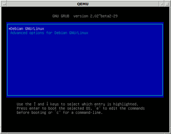
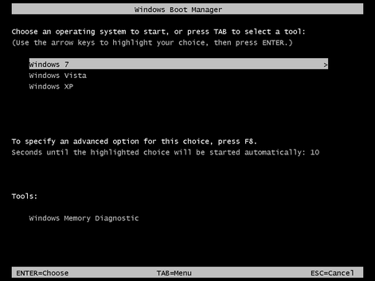
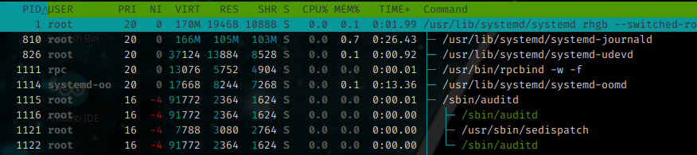
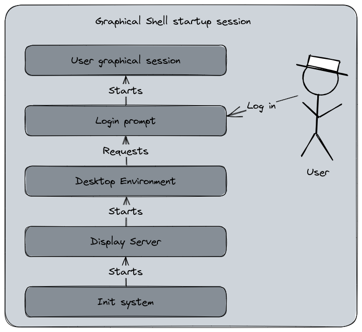

# Chapter 2 : The bootloader, Init process and Shell

## The bootloader

The [bootloader](https://en.wikipedia.org/wiki/Bootloader) is a software that is responsible for booting the operating system of a computer. Booting the computer is the moment when you push the "Power On" button and have the hardware powered and initializing. Then the software starting up in order to be able to use the computing resources and eventually waiting for the user's inputs. The hardware starts a small program stored into a read-only memory chip attached to the motherboard, formerly known as the [BIOS](https://en.wikipedia.org/wiki/BIOS), and now replaced by the [UEFI](https://en.wikipedia.org/wiki/UEFI).

These programs provide basic interfaces to manage the lower layers of the hardware : I/O configuration, system clock, storage devices, boot management, enabling or disabled hardware features, etc. The UEFI is  more advanced than the traditional BIOS since it can provide a graphical user interface and a basic shell able to executes a limited set of commands.


A boot sequence is composed of two stages : the first one, the BIOS/UEFI is started and searches for bootable devices. And the second one : the bootloader launches the operating system, giving control to the computer to it.

In our case, we will talk about the bootloader described in the second stage.

A bootloader for Linux is a commonly provided and installed component (but can be optional in some cases), that manages a list of bootable partitions and allows the user to select which one they can start, and even modifying its starting parameters. A very common use case is when you install Linux on a computer that already hosts Microsoft Windows : this is what we call a dual boot. In this setup, the Linux bootloader starts at the second stage and proposes to start Linux or Windows. If the user chooses the second one, Windows' specific bootloader will be loaded and starts the NT Kernel.



[Picture licensed under GPL, source Wikipedia][1]



[Picture licensed under Public Domain, source Wikipedia][2]

One of the reasons because the bootloader may be optional is because the boot management can be directly performed by the system firmware, or because the UEFI can also handle it in some cases. 

One of the most popular Linux bootloader is [GNU GRUB](https://en.wikipedia.org/wiki/GNU_GRUB). This program is installed during the Linux distro's initial setup and manages how the Linux Kernel is loaded to memory. GRUB maintains a list of bootable partitions and presents a menu at boot time, with a specific timeout. If the countdown is finished, the default partition will be started.

In our previous example, the most common use case is to manage a dual boot with Linux and Windows. But GRUB can also manage several Linux Kernel versions to select for startup. For example, when you have a new Kernel installed by the system updates, GRUB keeps the boot sequence entry for the previous Kernel version in case of any trouble with the new one. Additionally, you can edit in the boot arguments passed to the Kernel directly from the GRUB menu.

For example, you can blacklist a Kernel Module to ensure it won't start. And of course, you can have several different Linux Distributions installed on your system, GRUB will manage them too.

Please note that it's not actually GRUB that manages itself the boot list of the previous Kernels, but rather a post-installation step of the kernel package that updates GRUB's list of partitions.

[1]: https://en.wikipedia.org/wiki/Bootloader#/media/File:Debian_Unstable_GRUB2_(2015).png
[2]: https://en.wikipedia.org/wiki/Bootloader#/media/File:Windows_Boot_Manager_with_Windows_7,Vista_and_XP.png

## The Init Process

Remember our previous article and the Linux architecture diagram ? Now we will explain what is the Init System, or Init Process, that starts after the Linux Kernel startup.


Init, short for *Initialization*, is for Unix-based Operating Systems the first process started during the boot sequence, after the Kernel startup. It is recognizable by it's Process ID (PID) Number : 1. 



After the Linux Kernel has started, set up the system, and mounted the root file system, the init process is started. The Init process is a daemon, a background service, that will read its configuration files and starts the various other daemons that compose the operating system. If the Kernel is unable to start the Init daemon, it will result a Kernel Panic : a fatal error halting the system.

The Init process will determine, according to its configurations files, the runlevel. The [runlevel](https://en.wikipedia.org/wiki/Runlevel) is a mode of operation for an Unix-based system using the System V-style init method. It is a number, starting from 0 to 6, that defines the expected state of the system when entering at this runlevel.

There are three standards runlevels :

0. Turns off the device
1. Single user mode, the system starts without network interfaces or daemons
6. Reboots the device

The Linux Standard Base Specification defines the following six runlevels :

0. Turns off the device
1. Single-user mode, for administrative tasks
2. Multi-user mode, does not configure network interfaces and does not expert networks services
3. Multi-user mode with networking, starts the system normally
4. Not used/user-definable
5. Full mode, usually when the Display Manager and the Desktop Environment are started
6. Reboots the device

The Runlevels affectations can vary between the Linux Distros.

Basically, the Init daemon will starts the runlevel 3, 4 or 5 which are the most common for a normal usage. The runlevel 2 is preferred for emergency, recovery, or administratives tasks that wouldn't require network (ex : fixing a filesystem error). In the Init system configuration files, the daemons are affected to a runlevel that determine the moment for their startup during the boot sequence.

In this article, I've quoted two init daemons : System V and systemd (sic). System V is the main init daemon made for Unix systems. Linux used an init system that was compatible with System V, often referred as SysV, but other distributions were, or are, using other [init services](https://en.wikipedia.org/wiki/Init#Other_implementations). Nowadays, systemd has been adopted by most of the major Linux distributions, not without [critics](https://en.wikipedia.org/wiki/Systemd#Reception).

One main difference that systemd has is the replacement of the startup scripts and the runlevels by configuration files describing the daemons and when do they should start. It uses a parallel startup sequences that is expected to reduce the boot time. systemd uses a notion of targets to attain, inspired by the runlevel, but in a more semantic way. The targets are "multi-user", "graphical", "user-session", which mostly corresponds to runlevel 3 for the first one and 5 for the two others in the former init system's definition.

To ensure a certain compatibility for pre-systemd scripts, the historic command `init` became symbolic link to the `systemd` binary. And the `service` command (that managed the daemons start and stop) forwards to the `systemctl` management tool. This setup may vary according to how the Linux Distribution project integrates systemd.

```bash
$ file /usr/sbin/init
/usr/sbin/init: symbolic link to ../lib/systemd/systemd
```

Here is the definition of the CUPS service (the printing daemon) with systemd's configuration format. You may observe the notion of dependencies and orchestration with the `After` or `WantedBy` keywords. In this example, CUPS is started when the system is reaching the `multi-user` target.

```toml
[Unit]
Description=CUPS Scheduler
Documentation=man:cupsd(8)
After=network.target nss-user-lookup.target nslcd.service
Requires=cups.socket

[Service]
ExecStart=/usr/sbin/cupsd -l
Type=notify
Restart=on-failure


[Install]
Also=cups.socket cups.path
WantedBy=printer.target multi-user.target
```

Additionally, systemd became more a system management tools suite than an init daemon in the strict way. It provides a set of features to manage a centralized journal logging, device management, network, etc. This is one of the criticisms the community made against systemd, despite the various enhancement it provided, because of its complex design and its tendency to integrate too many system components into one service.

Arrived here, you may have noticed that there are always criticisms or controversies at various stage of a Linux distribution composition... That's the usual communities drama. It can be seen as a problem by some people, but for me it's also the fuel for the diversity in the offer the community provides because it drives the various forks and derivative works. And if everybody was always agreeing, it would be boring ! 😅 

End of parenthesis, now let's take a look to the next component, the Shell.

## The Shell

The [shell](https://en.wikipedia.org/wiki/Shell_(computing)) is a computer program that provides the interface between humans, or other programs, with the operating system. It can be a text shell, a command line interface, or a graphical shell, the Desktop Environment. Text-based Shell are working with the input of commands into a text console and returns a result meanwhile a graphical shell interacts with the user by manipulating visual objects such as windows, buttons and menus.


Once the init system has finished loading the various daemons and processes, it starts the login prompt. The user is now required to authenticate with the system in order to continue. After the user has input their username and password, the shell profile is loaded from the system-wide settings, and then, the specific user's settings. Once the profile is initiated, the shell switches to interactive mode and waits for user's inputs. The shell processes the commands typed by the user and returns their results.


*An example of commands passed to a shell session. In this session, I've moved to the `/tmp` folder and asked to display in which folder I'm currently working in (command `pwd`).*

The shell profile is a set of files installed at different places in the system. There are at the system's configuration files level (a directory name `/etc`), and in the user's home directory (usually `/home/{username}`). The directories and filesystems will be explained in the next article, I won't go into these details now.

### The text console shell

Usually, a server-oriented Linux distribution will not have a graphical user interface, only a command-line shell. This interface uses a scripting language composed of commands with arguments in order to perform tasks. There are several different shells : the Bourne Shell (sh, one of the most historic one), the Bourne-Again Shell or bash (one of the most common, part of the GNU Project), the Z shell or [zsh](/posts/zsh/) (a modern bash-compatible shell), etc. The command line interface can be used to manipulate files and folders, perform administrative tasks like creating and updating users, launching programs, managing the system, etc.

As the shell is a complete scripting language able to use conditions, return codes, functions, and various other features. It can be used to develop several automated procedures usually called "shell scripts", some can be very advanced. The interest to use this scripting language is, of course, to automatize various tasks on the system. In a shell script can do a lot of awesome and complexe things, but writing too complex shell programs is not what I would recommend. I would recommend to rely on a language like Python if you want to create complexe tasks.

The shell profile we talked about earlier is itself a set of shell scripts. For example, a bash-based shell will use the `~/.bash_rc` or `~/.bash_profile` file to load the user's specific profile. These file can contains aliases, functions, environment variables, etc.


For example, you may know [I like the](https://fortune.zedas.fr) `fortune` command and `cowsay`... So basically, my shell is displaying it at each opening. My file `~/.zshrc` (because I use zsh and not bash) contains this line : 

```bash
fortune | cowsay
```

A little word about the notation shown above, the piped notation. It's a way to combine the commands inputs and outputs into a pipeline. Another word about the `~` notation, it's a shortcut for the `/home/{user}` folder, we will explain this in the filesystem part.

Actually, the shell uses a notion of Standard streams. I won't detail them too much, there will be in a dedicated part for that, but in a nutshell there are three communications channels the shell can use :
- Standard input (stdin) for user inputs
- Standard output (stdout) for commands outputs
- Standard error (stderr) for errors or diagnostic messages

Thanks to redirections functions, the user can interact and use the three of them at various degrees such as manipulating the output of a command, input a command's content from the standard input instead of reading a file, etc. We will see that in a dedicated article.

### The Graphical shell

As we said above, a shell can also be a graphical session. For Linux, you may have heard about the notion of Window Manager, or Desktop Environment. [GNOME](https://www.gnome.org), [KDE](https://kde.org), [Cinnamon](https://projects.linuxmint.com/cinnamon/), [Xfce](https://xfce.org), the choice is vast. These Desktop Environments have all their own user experience and goals (user friendly, lightweight..) and a Linux distribution shipped with a default Desktop Environment can easily switch to another one without changing the operating system.



A graphical shell is composed of three elements : 
- A Display Server
- A Window Manager
- A Desktop Environment

A Display Server is a part of the graphical system for a Linux distribution. The Display Server is the bridge between the Desktop environment and the Linux Kernel. It can uses network capabilities to display a software that is actually running on a remote server. The historic Display Server on Linux is the revered [X11](https://en.wikipedia.org/wiki/X_Window_System), or X Window System (protip : ensure you don't write "X Windows System", you may have people grind some teeth), created in 1984 to provide a framework for a GUI environment for Unix systems. Another Display Server for Linux and Unix-like systems is [Wayland](https://en.wikipedia.org/wiki/Wayland_(protocol)), far more younger, it aims to replace X11 with modern and simpler base.

The Window Manager is the programs that runs on top of the Display Server. It provides the look and feel of the graphical interface. This component is responsible for the windows and buttons arrangement, decorations, handling the user interactions, etc.

The Desktop Environment is built on top of both Display Server and Window Manager. It's a complete suite of applications that provides a consistent user experience. The most well known are GNOME and KDE Plasma, with also Xfce which is older. Like the Linux Distributions themselves, the Desktop Environments are developed and maintained by communities with a purpose and a philosophy on their own.

One thing I like a lot with the Linux Desktop Environments is that you're not locked by the one the Linux Distribution integrates. Personally, I don't really like KDE's layout and GNOME has lost me following its changes in the version 3. However, there are alternatives than can be installed and usually switched to with a little adaptation (the integration may not be perfect and some configuration adjustments could be required) and you can still use your favorite Linux distribution with your favorite Desktop Environment. In my case, I like Cinnamon.

Of course, having a graphical shell does not prevent to use a text console shell. The Desktop Environment provides a terminal emulator that allows to work in command line. My favorite is [Terminator](https://terminator-gtk3.readthedocs.io/en/latest/). Also, the system can be configured to disable the graphical shell and running it on-demand to preserve resources.
