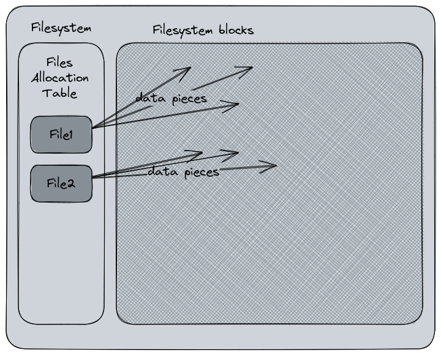

# Chapter 3 : The Filesystems {#chapter-3}

## What is a filesystem ? {#chapter3-chat-is-a-filesystem}

A filesystem[^filesystem], or FS, is the method an operating system uses to structure the data on a storage device (hard drive, SSD, USB flash stick, whatever). It's a logical view of the physical storage that describes how the disk is organized and how and where the various data pieces are stored and identified to compose a consistent file. Indeed, when a file is written on disk, the content is actually cut into several parts written in blocks. Your file is like a series of books stored on a shelf. In this metaphor, the shelf would be the file and the books its fragments. The blocks size may vary according to the filesystem format settings.

In a more simple words, the filesystem is the mapping chart of the physical storage for the operating system. Here is a very simple diagram to explain this :



Ever heard about "formatting a disk" ? For the end-user, this action usually means "erasing the content". Actually that's a side effect because the formatting process will commonly rewrite the file allocation table, delete the files metadata, and throw back the related sectors into the "free sectors pool". In a nutshell, the disk "forgets" its contents. But the data pieces on the disk may still remain until they are overwritten by new ones. This is how the recovery tools work when you try to recover a file you've erased by mistake : they usually inspect the sectors for orphaned data pieces and try to reconstruct the file.

There are various filesystems type existing. This diversity is mostly related to the diversity of storage types : optical, tapes, database filesystems, network filesystem, etc. One very well known is the FAT[^FAT] - File Allocation Table -, created in 1977 for floppy disks and adapted for hard drives, it was also the MS-DOS default filesystem, also for Microsoft Windows, until NFTS[^NTFS] replaced it. One of the biggest advantage for the FAT filesystem (mostly in this exFAT and FAT32 version) is that it became a *de facto* standard and is used in almost every device that uses external storage. For instance, my camera formats its memory cards in exFAT. Despite being patented by Microsoft, the exFAT and FAT specifications has finally been publicly released by the company in 2019.

On Linux, the most common filesystems type today are ext4[^ext4] (preceded by ext2 and ext3), xfs[^xfs] or btrfs[^btrfs]. Each of them has its specificity and purpose :
- ext4 is pretty common for Linux. It's the successor or ext3 which was very popular
- xfs targets high performance and large storage arrays but it can be used without this specific purpose
- Btrfs is more recent and supports advanced features like snapshots, subvolumes, and online defragmentation. Btrfs is the default filesystem for Fedora Linux since a couple of releases (Fedora 33).
- FAT32, exFAT, and Microsoft's NTFS are also supported by Linux
- Tmpfs[^Tmpfs] is also a filesystem now common on Linux to replace the physical storage of the /tmp partition with a virtual partition in the system's RAM, typically to avoid unnecessary writings for flash-based storage devices like the SSD that would reduce their lifespan.
    - The same idea exists for the Swap partition
- For network file systems, you will usually hear about NFS[^NFS] and SMB[^SMB] protocols that can mount a remote storage through the network layers.

ext4, xfs and Btrfs have all a common thing : they're journaling filesystems (NTFS too, but it's a Windows native FS, not Linux). In a nutshell, a journaling filesystem keeps tracks of the changes not yet committed into a "journal", a circular log file. In case of a failure event (power failure, system crash, etc), these filesystems can be brought online faster and are more resilient to the risk of corruption. Basically, the journal stores the write events before actually executing them on the disk, preventing the risk of orphaned data blocks or storage leak, meaning the free sectors are not released into the pool for being reused. The journaling filesystem has been created by IBM with AIX 3.1's JFS in 1990. Microsoft implemented it in its Windows NT's NTFS in 1993. For Linux, the journaling FS arrived in 2001 with ReiserFS and ext3.

## The filesystem structure and mount concept {#chapter-3-the-filesystem-structure-and-mount-concept}

Linux's filesystem organization is standardized in the Filesystem Hierarchy Standard[^filesystemhierarchystandard] specification. Inherited from the Unix Filesystem[^UnixFilesystem], the structure is very similar. On Microsoft Windows, a filesystem is represented by a letter, usually the `C:` drive for the main one, and `D:` for the next one, which may be an optical drive, etc. On Unix and Linux, this notion does not exists. 

### The Filesystem hierarchy {#chapter-3-the-filesystem-hierarchy}

On Linux, the primary hierarchy level is the *root*, represented by the `/` character. There is no logical separation like Windows do with its letters. On Linux, the various filesystems present in the partition table are mounted in subsequent levels of the root folder. All files and folders are stored after the root level, even if they are physically on another device.

Here is the content of my root folder, `/`, displayed by the command `tree` :

```bash
$ tree -d -L 1 /
/.
├── afs
├── bin -> usr/bin
├── boot
├── dev
├── etc
├── home
├── lib -> usr/lib
├── lib64 -> usr/lib64
├── lost+found
├── media
├── misc
├── mnt
├── net
├── opt
├── proc
├── root
├── run
├── sbin -> usr/sbin
├── snap -> /var/lib/snapd/snap
├── srv
├── sys
├── tmp
├── usr
└── var

```

Let's explain some of these folders :

| Directory | Description                                                                                                                                                                                                                                                                                                                                                                                                                            |
|-----------|-------------------------------------------------------------------------------------------------------------------------------------------------------------------------------------------------------------------------------------------------------------------------------------------------------------------------------------------------------------------------------------------------------------------------------------------|
| `/`       | The first level of the folder hierarchy. Everything is under it.                                                                                                                                                                                                                                                                                                                                                                          |
| `/bin`    | This folder contains the essential binaries, or executable programs, required for the single-user mode, the mode without the network layers enabled commonly used for administrative and recovery tasks (We've seen that in the Part 2's Runlevels sections)                                                                                                                                                                                            |
| `/boot`   | This is the place where the bootloader is installed.                                                                                                                                                                                                                                                                                                                                                                                      |
| `/dev`    | This folder contains the devices files, a description of the physical devices on the system, and also logical ones. For example, you can invoke `/dev/random` to display a random number, or redirect something to `/dev/null` to discard it immediately. Also your storage is represented in a way such as `/dev/sda1`, etc.                                                                                                             |
| `/etc`    | This folder contains the host-specific configurations files. Here, you may find for example the `/etc/hosts` file that associates an IP address to a host name, or `/etc/fedora-release` (adapt it to any distro) that contains the release version of your distribution, or `/etc/hostname` that contains the computer's name.                                                                                                                                                                 |
| `/home`   | This is the home folder of the users of the system. Unless other statement during the creation, a user will always have its personal files stored into a subfolder named after the username in this directory. (ex : `/home/seb`). A shortcut to this folder exists : the character `~`. Typing `cd ~` is equivalent to typing `cd /home/seb` for example. Additionally, invoking `cd` without args will also redirect to the home folder. |
| `/lib`    | Contains the essential libraries for the binaries. Libraries are specific components included during the coding of a binary to provide a specific feature, a collection of functions, dataset definitions, etc. For example, the `openssl` lib will provide the TLS encryption functions that can be used by a program or `libyaml` will provide the functions for YAML data structure manipulation.                                                                                                |
| `/media`  | This folder is a mount point for the removable medias like CD-ROM and USB flash storage. A directory in`/run` can also be used for temporary filesystems mount points.                                                                                                                                                                                                                                                                                                                                                          |
| `/mnt`    | This folder is also for mount points, for temporary ones too.                                                                                                                                                                                                                                                                                                                                                                                 |
| `/opt`    | This folder usually stores the application software packages, which are not especially shipped with the distribution by default.                                                                                                                                                                                                                                                                                                          |
| `/proc`   | This virtual filesystem stores the process and kernel informations files. You may find there files named after the Process ID of a running program and various informations inside the kernel uses too.                                                                                                                                                                                                                                   |
| `/root`   | The only by-design exception of the `/home`, `/root` is the `root` user home folder. We never talked about the `root` user : it's the super admin of a Linux system. We will address this point in the article dedicated to the users management.                                                                                                                                                                                         |
| `/run`    | A folder containing run-time data like variables, currently logged-in users, running daemons...                                                                                                                                                                                                                                                                                                                                           |
| `/sbin`   | The essential system binaries for the single-user mode. It's like the `/bin`, but the commands available there are only addressed to power users or the system admin (root).                                                                                                                                                                                                                                                              |
| `/srv`    | A folder reserved for server data, like a web server or FTP.                                                                                                                                                                                                                                                                                                                                                                              |
| `/tmp`    | A folder, which is now a filesystem stored in RAM, used for temporary files. It's oftenly not-preserved on reboot, you may only store here disposable files.                                                                                                                                                                                                                                                                              |
| `/usr`    | A secondary hierarchy structure that reproduces the `/` structure. It contains the majority of the multi-users commands, utilities and applications. If you look back at the directories lists I've displayed above, you may notice that `/bin` and that `/sbin` are directing to `/usr/bin` and `/usr/sbin`. It's usage and integration may vary across the Linux distrubtions.                                                          |
| `/var`    | Variable files, may content caches, logs, locks files, etc. It can be seen like the `/tmp` as a non-critical file storage, but this one is preserved are reboot.                                                                                                                                                                                                                                                                          |


## What is mounting a filesystem ? {#chapter-3-what-is-mounting-a-filesystem}

So far, we have seen that a filesystem is how the storage is seen and sorted by an operating system, and how it structures it. But in order to be exploited, a filesystem needs to be mounted. Mounting a filesystem is associating a storage device's partition to a path the system will be able to access and use the data stored on it.

The physical device has a partition table described how its content is organized : which type of filesystem, if it's a bootable filesystem, etc. When you plug an USB flash drive to your computer, the Kernel will detects a new device. The device is detected as a file storage and the related driver takes it in charge. Then, the Kernel associates the filesystem present on the removable drive to a mount point (usually `/mnt/the-partition-name` or `/run/media/user/partition-name`). 

For example, when I insert my camera SD Card, the system will mount it like this :

```bash
/dev/sdc1 on /run/media/seb/NIKON Z 5 type exfat 
```

- `/dev/sdc1` is the device's partition file my system attributed to the SD Card
- `/run/media/seb/NIKON Z 5` is the folder on my system from where I can access to the SD Card's content
- The `type` field indicates which filesystem is used. In this case : exFAT.


To compare with the Windows world, my SD Card would have been mounted with a `D:\` letter. In the Linux world, the SD Card is mounted in `/run/media/seb/NIKON Z 5`, a directory path. Why ? Because as we said above, in the Unix filesystem, each file and folder is below the root top level hierarchy.

Another example. My computer has two drives : one for the system, one for the data. If I go in `/media` and I use the command `df .` to display the remaining storage capacity of the current path, I'll see I'm on the root filesystem.

```bash
$ cd /media
$ df . 
Filesystem               1K-blocks    Used   Available Use% Mounted on
/dev/mapper/fedora-root  71670904 58155208   9829296   86%  /
```

Now, I move to the `data/` folder which is actually the mountpoint of my secondary drive. The filesystem has changed, the amount of storage also (yes, I will do some cleanup one day).

```bash
$ cd /media/data
$ df .
Filesystem     1K-blocks      Used Available Use% Mounted on
/dev/sda       960303848 885484368  25964968  98% /media/data
```

If I do the same for my NAS, a storage available from my network, mounted on `/media/nas` : 

```bash
$ cd /media/nas
$ df . 
Filesystem                1K-blocks       Used      Available Use% Mounted on
192.168.1.101:/nas    5814086144 4873881088 647169024  89% /media/nas
```

Let's go a little further with the filesystem mountpoint concept. Usually, the root filesystem contains `/boot`, `/etc`, `/bin`, etc. But, let's admit I have a 250GB disk for the system, and I want to use a 1TB disk for the `/home`. That's not a problem, the root filesystem could be installed on the 250GB disk, and the `/home` folder will be mounted from the partition on the 1TB disk. That's a common setup to preserve the content of the `/home` directory in case of a system reinstallation : you can avoid formatting the filesystem hosting the `/home` data in the process.

When we seen the startup sequence of a Linux-based operating system, one step was "Mounting the filesystems". Linux don't guess it miraculously, they're defined into a system file : `/etc/fstab`. This file contains the name of the physical partition, the mountpoint, and the options to apply to each of the entries defined here. Mount the filesystems during a Linux boot sequence means : mounting the `/etc/fstab` content.

Example of a fstab file content :


```bash
/dev/mapper/fedora-root /                       ext4    defaults        1 1
UUID=0feb407e-cc33-4718-98b7-f9e7362968c3 /boot                   ext4    defaults        1 2
```

Each filesystem defined in `/etc/fstab` can be quickly mounter by the `mount` command.

For example, if I have the following line in `/etc/fstab` : 

```bash
/dev/sdc1 /media/somefilesystem ext4 defaults 1 1
```

Using `mount /media/somefilesystem` will mount it according to this entry defined in `/etc/fstab`. There is also the autofs[^autofs] module that is able to automatically mount a filesystem defined in another set of configuration files when going into its mountpoint path.

On Linux servers, we usually use the Logical Volume Management[^lvm] which is an flexible abstractive filesystem that present a consistent storage volume composed of several physical disks. It's main asset is that you can extend the filesystem capacity by adding physical disks to the array and allocating the capacity to the filesystem, it's very used in virtualization (in this case, the disks are virtual). On a Server's filesystem, the `/var`, `/opt` and `/srv` would be mounted from LVM filesystems than can be extended it the storage capacity gets too small during the ramp-up of a service for example.

[^filesystem]: Filesystem https://en.wikipedia.org/wiki/File_system)

[^FAT]: File allocation Table https://en.wikipedia.org/wiki/File_Allocation_Table

[^NTFS]: NTFS https://en.wikipedia.org/wiki/NTFS

[^ext4]: Ext4 https://en.wikipedia.org/wiki/Ext4

[^xfs]: XFS https://en.wikipedia.org/wiki/XFS

[^btrfs]: Btrfs https://en.wikipedia.org/wiki/Btrfs

[^Tmpfs]: Tmpfs https://en.wikipedia.org/wiki/Tmpfs

[^NFS]: Network File System (Protocol) https://en.wikipedia.org/wiki/Network_File_System_(protocol)

[^SMB]: Server Message Block https://en.wikipedia.org/wiki/Server_Message_Block

[^filesystemhierarchystandard]: Filesystem Hierarchy Standard https://en.wikipedia.org/wiki/Filesystem_Hierarchy_Standard

[^UnixFilesystem]: Unix Filesystem https://en.wikipedia.org/wiki/Unix_filesystem

[^autofs]: autofs https://www.kernel.org/doc/html/latest/filesystems/autofs.html

[^lvm]: Logical Volume Management https://en.wikipedia.org/wiki/Logical_volume_management

