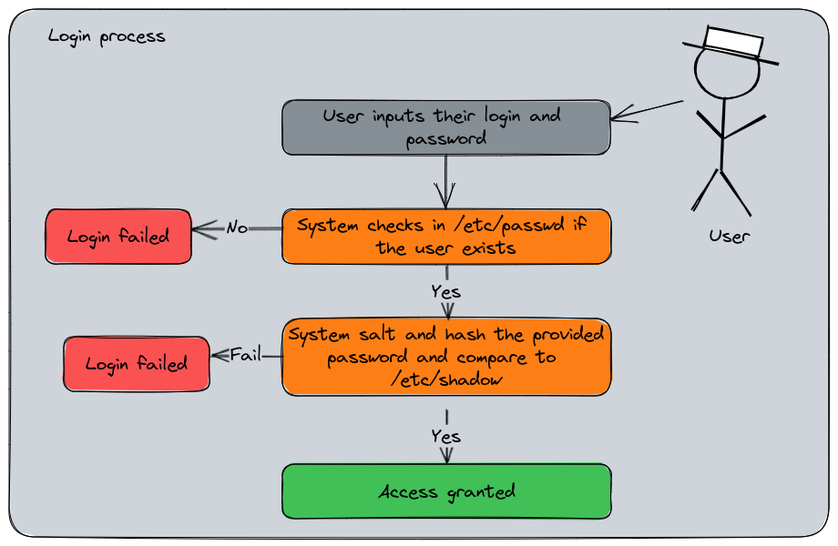

# Chapter 5 : The users management {#chapter-5}

## What is a user and group for Linux ? {"chapter-5-what-is-a-user-and-group-for-linux}

If you remember the Unix history in the first chapter, one detail about the *Multics*, then *Unix* conception was to be multi-users. A [multi-user software](https://en.wikipedia.org/wiki/Multi-user_software) is a program able to give access to the computing resources by multiple users of the machine. Nowadays it must seems to be pretty obvious, but in the dark ages of computing, the ability for a computer to executes several processes simultaneously was limited. The concept of multitasking arrived in the years 1960, and the computers were able to share CPU time and resources for several processes at once, thanks to the implementation of scheduling, priority management, and inter-process communication. 

One of the result of this implementation is the "users" management. In computing, a user is the physical person using a computer. It's also a logical identity the operating system knows with specific permissions and rights : that's the user account. The user account identity is usually protected by a password to ensure only people aware of this secret should access these specific computing resources.


The group is the ability to regroup several users into one or more groups, allowing to manage the permission at the group level and not at the user level, reducing the administrative tasks charge.


Let's show an example. Here is a sample of my blog sources on my computer returned by the command `ls -l` :

```bash
drwxr-xr-x.  4 seb seb 4096 Jul 16  2022 assets
-rw-rw-r--.  1 seb seb 1676 May  1  2022 config.yaml
```

During the file permissions exploration, we learned that the file has three levels of accesses : the Owner (or User), the Group, and the Others. The owner and group are displayed just after the file permissions, in this case : `seb` and `seb`. The `stat` command on `config.yaml` will provide more details :

```bash
$ stat config.yaml
  File: config.yaml
(...)
Access: (0664/-rw-rw-r--)  Uid: ( 1000/     seb)   Gid: ( 1000/     seb)
```

As you may see, the User and the Groups are named `Uid` and `Gid` : User Identifier, Group Identifier. My file is owned by my user; `seb`, and its group `seb`, but actually, the User Identifier and Group Identifier are the number `1000` and `1000`. On Linux, the username ('seb') and the Uid ('1000') are both unique keys in the users database. Same for the group name and group ID.

I think I'm starting to confusing you with the fact that my group and user have the same name and ID. That's pretty common actually for the main user of a Linux system since the uid and gid counter both start at 1000. But some other system built-in users can have different user id and group id. For example the user `flatpak` :

```bash
$ id flatpak
uid=980(flatpak) gid=978(flatpak) groups=978(flatpak)
```

The GID and UID are very important, because that's actually the ID used for files ownership. If you are in a case of a filesystem shared by several servers, having UID or GID corresponding to different users may provoke inconsistencies.

Each time a user is created on a Linux system, by default, they will have a group named after their username.

The `groups` command returns the groups your current user is member of :

```bash
$ groups
seb wheel dialout lxd pkg-build
```

Why am I member of these other groups ? That's because they'll provide to my user some extended permissions and my user have been automatically added to these groups by the installation of these tools.

For example, `wheel` on Fedora is the group for the `sudoers` administrators members. If I wasn't in this group, and if no other type of `sudoers` configuration was made, my user would be unable to invoke the `sudo` command properly.

## Linux users management {#chapter-5-linux-users-management}

Remember when I've wrote : "On Unix, everything's a file" ? Here is a concrete example. The `groups` command displayed my groups membership. The `id` command returns the current logged username with several other informations. In this case : `seb`. These commands do not rely on a mystical power : they just read configurations files.

The Linux users are defined in the following file : `/etc/passwd`. With no arguments, the `id` command returns the informations about the currently logged user. 

```bash
$ id
uid=1000(seb) gid=1000(seb) groups=1000(seb),10(wheel),18(dialout),969(lxd),972(pkg-build) context=unconfined_u:unconfined_r:unconfined_t:s0-s0:c0.c1023
# but you can specify another user
$ id root
uid=0(root) gid=0(root) groups=0(root)
```

### The Linux login process summarized {#chapter-5-the-linux-login-process-summarized}

Here is the login process summarized into a diagram, this will help to understand the interactions between the files we will explain.



### Users accounts : /etc/passwd {#chapter-5-users-accounts-etc-passwd}

`id` finds these informations in `/etc/passwd` : 

```bash
# grep is a command that search for a pattern in a file
# and returns the corresponding line
$ grep seb /etc/passwd
seb:x:1000:1000:Seb:/home/seb:/usr/bin/zsh
```

A line in `/etc/passwd` contains the following fields separated by `:` :

- `seb` : Username
- `x` : Formerly, this is where the hashed password was stored for input validation. Now it's elsewhere, we'll see that after.
- `1000` : User ID, the unique identifier number the system uses to distinguish users
- `1000` : Primary Group ID number, the numeric identifier of my group relating to the groups table
- `Seb` : the Gecos field, the user's description (usually the full name displayed)
- `/home/seb` : the home user's path
- `/usr/bin/zsh` : the user's default shell started when the user logs into the system

### Groups : /etc/group {#chapter-5-groups-etc-group}

And for the groups membership, there is the `/etc/group` file :

```bash
$ grep seb /etc/groupminikube
wheel:x:10:seb
dialout:x:18:seb
seb:x:1000:
pkg-build:x:972:seb
lxd:x:969:seb
```

Which is cut into these fields :

- `wheel` : The group name
- `x` : A field for a password, generally not used
- `10` : the Group ID, the unique identifier used by the system
- `seb` : the users list members of this group, separated by commas.

You may have noticed the group named after my username having no membership : that's normal, since it's my primary group, its membership is instructed in the `/etc/passwd` entry. The `/etc/group` is more related to the secondary groups membership.

### Users passwords : /etc/shadow {#chapter-5-users-passwords-etc-shadow}

And the last file about user management would be `/etc/shadow`, a file that replaced the password field in `/etc/passwd`. Unlike `/etc/passwd` and `/etc/group`, this file is impossible to read for any user :

```bash
$ stat /etc/shadow
  File: /etc/shadow
  Size: 1635      	Blocks: 8          IO Block: 4096   regular file
Device: 253,0	Inode: 2758895     Links: 1
Access: (0000/----------)  Uid: (    0/    root)   Gid: (    0/    root)
# Absolutely no permissions !
```

But since root can do anything, let use its power to see the content :

```bash
$ sudo grep seb /etc/shadow
seb:😋:😬:0:99999:7:::
# Censored output :p
```

This file has the following fields :

- `seb` : the username attached to this entry
- 😋 : this field is the salted and hashed password in the following format : `$id$salt$hashed`. The `$id` field is the algorythm used for encryption :
    - `$1$` : MD5
    - `$2a$` : Bcrypt
    - `$2y$` : Bcrypt
    - `$5$` : SHA-256
    - `$6$` : SHA-512
- 😬 : this field is the days, in epoch format, since the last password change
- `0` : The number of days until change is allowed
- `99999` : The number of days before change is required
- `7` : Then number of days the system will warn for the expiration
- Number of days to lock the account if no logins since
- Number of days since epoch when the account expires
- Reserved and unused

Salt and hash are the cryptography concepts used for passwords storage (hash can has other purposes, but that's not the topic). The hash is the result of a mathematical function that transforms a string of characters into a unique representation, the "digest". The salt is a complementary random value added to the password before the hashing process adding a randomness in the data and making it more difficult to guess using brute force attacks. When the user logs into the system, they'll provide their password. Since the system is the only one to knows the salt value associated to the password, it calculates the hash and compares it with the stored value. If both hashes matches, the access is granted. If not, the login failed.

### About passwordless users {#chapter-5-about-passwordless-users}

Linux's users can be passworldless, meaning they have no password for login. They basically can't log into the shell by themselves since the process requires a password for a local connection. But that doesn't mean a user couldn't log with this account since a privileged one can switch to any user. The passwordless users are mostly for local services account and should be used only in this way. A human user or a service account meant to connect on other systems *must* have a password defined. And it's still a good practice to set passwords to service account, even if they're random and not used.

Passwordless account should have a very limited perimeter of actions and permissions and being unable to open an interactive session. If they're intended to be used for automated deployment procedures or script (so with enough privileges to be able to do destructive or intrusive actions), they should be protected by a password (even a random one) and use a SSH key to log into the system. These accounts should be regularly audited to ensure nobody would hijack them.

Additionally, please note that there are other ways to log into a Linux system. The user account could be provided by an Identity Manager (LDAP, IAM, etc), or you may use SSH keys. We will explore the SSH key in another article.

### A note about the root user {#chapter-5-a-note-about-the-root-user}

We mentioned `root` a couple of time and for each example, we said that `root` can override the securities and policies. Now that we are talking about managing users, let's have a word about the most critical one on a Linux system.

`root` is created during the system installation, it always has the UID and GID 0. `root` is the owner of the root filesystem `/` and many configurations and binaries. And last but not least, `root` is the super-administrator of a Linux system. This user is able to do perform absolutely **anything** without any permission because it can overrides them by design.

Want to delete your filesystems ? `root` can do it. Want do delete your bootloader ? `root` can do it. Want to change the ownership of every files and directories ? `root` can do it. Want do uninstall system packages ? `root` can do it. `root` can also impersonate and switch to any of the system's users without know their passwords.

Now I think you understand what is my point : `root` must be used **only** when it's absolutely necessary. Login into `root` to do several actions is a terrible practice, and this user by must reserved to system administrators only. Because remember : Linux is not foolproof.


Additionally, since `root` can navigate and read everything on the filesystem, having the keys to this user is a great responsibility for an admin since it can access to the regular users personal content, which is protected by the privacy regulations (even in companies !).

Some good practices about `root` (non exhaustive list) : 

- Limit the usage of this user, only when it's absolutely necessary for administrative tasks
- Use `sudo` instead of switching to `root`. We described this command in the previous chapter, it can assign a specific list of tasks for a privileged user and trace these actions in the audit logs
- Use strong passwords, often renewed. In enterprise context, the access to a Linux (and Windows too) server should be managed by [Identity Management](https://en.wikipedia.org/wiki/Identity_management).
- `root`'s activity should be audited and monitored to identify suspicious activity
- Keep your system up to date because trying to break `root`'s access thanks to vulnerabilities is one of the attack pattern
- `root` should not be able to open remote ssh sessions, that's usually a default setting in openSSH server to forbid it

### Create, update, remove groups {#chapter-5-create-update-remove-groups}

New groups can be created with the command `groupadd` and specifying the group's name.

```bash
$ groupadd mygroup
$ grep mygroup /etc/group
mygroup:x:1000:
# I create a directory and make "mygroup" owner
$ ls -l 
drwxr-xr-x.   2 root   mygroup 4096 Feb 16 21:08 myapp
```

By default, the system will increment the default GroupID counter by one. In this case, the first GID was `1000`. In a more managed environment, we like to predict the UID and GID, define then, standardize them, and ensure they're the same anywhere. Additionally, it helps to avoid inconsistencies in case of filesystems shared across several servers. For example, if the group ID `1000` for server A is "mygroup" an for server B is "anothergroup", you may encounter unexpected behavior with the permissions. That's the same for the users.

So we can specify the group ID if we normalized it.

```bash
$ groupadd -g 1002 anothergroup
$ grep anothergroup /etc/group
anothergroup:x:1002:
```

Let's say I've made a mistake while creating "mygroup" and I wanted to user the GID `1200`. We can change it using `groupmod`.

```bash
$ groupmod -g 1200 mygroup
$ grep mygroup /etc/group
mygroup:x:1200:
# but there is a side effect...
$ ls -l
drwxr-xr-x.   2 root     1000 4096 Feb 16 21:08 myapp
```

The directory `myapp` remains owned by the "1000" group. That's because the owner is actually the UID and GID and not the username. To restore the ownership, we need to change them.

```bash
$ chown root:mygroup myapp
$ ls -l
drwxr-xr-x.   2 root   mygroup 4096 Feb 16 21:08 myapp
```

You can also rename the group :

```bash
$ groupmod -n thegroup mygroup
$ grep thegroup /etc/group
thegroup:x:1200:
$ ls -l 
drwxr-xr-x.   2 root   thegroup 4096 Feb 16 21:08 myapp
```

Unlike the GID change, the renaming has no impact.

Now I want to delete this group, I use `groupdel` :

```bash
$ groupdel thegroup
$ ls -l
drwxr-xr-x.   2 root     1200 4096 Feb 16 21:08 myapp
```

The ownership of the file is preserved, but since it correspond to nobody, the GID is displayed instead of the group name. This directory is basically orphaned from the group's perspective.

### Create, update, remove users accounts {#chapter-5-create-update-remove-users}

Now, let's create our users. For my application, I want to create the user "poochiapp" with its group named "poochigroup". The `useradd` command will do that :

```bash
# first we create the group
$ groupadd -g 1200 poochigroup
# then the user, assigned to the poochigroup and
# having its home in /poochiapp
$ useradd -u 1200 -g 1200 -d /poochiapp poochiapp
$ ls -l 
drwx------.   2 poochiapp poochigroup 4096 Feb 16 21:21 poochiapp
$ id poochiapp
uid=1200(poochiapp) gid=1200(poochigroup) groups=1200(poochigroup)
$ grep poochiapp /etc/passwd
poochiapp:x:1200:1200::/poochiapp:/bin/bash
$ grep poochiapp /etc/shadow
poochiapp:!!:19404:0:99999:7:::
# The user has no password
# That's normal, none was provided
```

BTW, I did choose the group ID 1200 on purpose, look what happened to the directory "myapp", still owned by GID 1200 :

```bash
$ ls -l
drwxr-xr-x.   2 root      poochigroup 4096 Feb 16 21:08 myapp
```

Let's set a password to this user. I use the command `passwd` with the user to change. If no user is provided, `passwd` will be for the current logged user.

```bash
$ passwd poochiapp
Changing password for user poochiapp.
New password: 
BAD PASSWORD: The password is shorter than 8 characters
Retype new password: 
passwd: all authentication tokens updated successfully.

# I did choose a bad password on purpose,
# passwd checks the dict knowledge and resilience

$ grep poochiapp /etc/shadow
poochiapp:$y$j...$wj.....W1:19404:0:99999:7:::

# now the user has a password
```

`passwd` is actually a very versatile command. You can verify the user's status with it and set various settings regarding its password.

```bash
# Display the status of poochiapp
$ passwd -S poochiapp
poochiapp PS 2023-02-16 0 99999 7 -1 (Password set, unknown crypt variant.)

```

- `PS` : This message says the password is set
    - Others values can be :
        - `LK` : locked
        - `NP` : Password not set
- `2023-02-16` : The date the password was changed for the last time
- `0` : The minimum age in days the password can have
- `99999` : The maximum age in days the password can have (in this case, the password never expires)
- `7` : The warning period for the expiration, in days
- `-1` : Inactivity period for the password, in days

Let's expire the password to see :

```bash
$ passwd -e poochiapp
Expiring password for user poochiapp.
passwd: Success
$ passwd -S poochiapp
poochiapp PS 1970-01-01 0 99999 7 -1 (Password set, unknown crypt variant.)
# now the last changed date is 1970
# if the user logs with its password, the system
# will prompt for a renew

$ su - poochiapp
Password: 
You are required to change your password immediately (administrator enforced).
Current password: 


# Lock the user's password
# The user itself is not locked,
# its password has just been disabled
$ passwd -l poochiapp
Locking password for user poochiapp.
passwd: Success
$ passwd -S poochiapp
poochiapp LK 1970-01-01 0 99999 7 -1 (Password locked.)

# the user remains usable
$ su - poochiapp
[poochiapp@9b1c66ab4e3f ~]$ 

# but its password is disabled
[poochiapp@9b1c66ab4e3f ~]$ su - poochiapp
Password: 
su: Authentication failure
```

You may have noticed the command I've used to test the user's login : `su`. This command, meaning "switch user" defaults to switch to `root`. If we provide a username, it will switch to it. Since `root` can login with no password to any user, no password is required. But when it's a normal user, the login prompt will be displayed.

A way to completely locking the user, making it unable to open a session, is to change its default shell. Currently, poochiapp has `/bin/bash` for shell. We can change it with the `usermod` command and set it to `/sbin/nologin`.

```bash
$ usermod -s /sbin/nologin poochiapp
$ su - poochiapp
This account is currently not available.

# haha ! even root can't bypass this !

$ su -s /bin/bash - poochiapp
[poochiapp@9b1c66ab4e3f ~]$ 

# sorry to disappoint you :D
# I've asked su to change the user's default shell
```

`usermod` can update the user ID, name, set and expiration date, etc. The "lock" feature is the same as the one provided by `passwd` which consists in adding a `!` in the password's hash to invalidate it. Unlocking the user removes the `!`.

Now let's get rid of poochiapp, delete the user with `userdel`.

```bash
$ userdel poochiapp
$ ls -l
drwx------.   2   1200 poochigroup 4096 Feb 16 21:44 poochiapp

# note that I haven't be prompted for any confirmation.
# On Linux, the admin user should now what they're doing !
```

As you can see, the group has been preserved since it's a different thing. The home directory is now orphaned. An option `-r` is available to delete also the home directory, a good thing for cleaning up the system.

> Since everything's managed by configurations files, can I edit them directly ?

Yes you can, but you shouldn't, it's a bad practice. You can edit the default's shell of a user or its Gecos without any consequences, but updating the UID/GID or username may have issues because the administration commands will also refresh the various caches where the information is stored. It could lead to inconsistencies in configurations, especially when it's managed by another deployment tool such as Ansible or Chef or by a system package.
