# Chapter 6 : The Standard Streams

## What are the Standard Streams

On a Linux text-based shell (and on other systems too), you have the notion of Standard Streams. In the shell, you can interact with commands, files and manipulate them through the Standard Streams. The Standard Streams are the input and output communication channels the shell can provide. There are 3 of them : 

- The Standard Input (**stdin**) : this is the stream that inputs data to a program. Basically, the command line uses the stdin to receive inputs. If you type the command `ls` to list a directory content, you use the stdin.
- The Standard output (**stdout**) : this is the counterpart of the stdin. A command output will be sent through this communication channel. In our `ls` example, the listing of the directories will be displayed by the stdout channel.
- The Standard error (**stderr**) : this channel is also an output, but specific to any error messages or diagnostics the command may return. For example, if I run my `ls` command in a path that doesn't exist, the "No such file or directory" output will be returned through the stderr channel

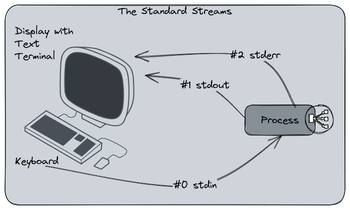

Each of the three streams have a dedicated number : 

0. Stdin
1. Stdout
2. Stderr

These numbers are useful in order to interact with the streams and manipulate them, especially for the stream redirections.

## The stream redirections

The stream channels are completely transparent for the user because no matter from which stream the output came from, the display will be the same. Despite being two different channels, stdout and stderr are displayed in the same way on the terminal.

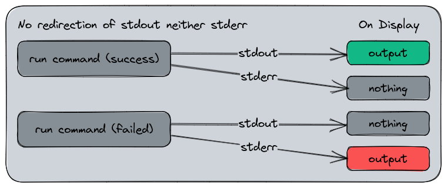

The default stdout and stderr channels.

Here is the stdout and stderr in application :

```bash
$ ls
afs  bin  boot  dev  etc  home  lib (...)
$ ls notexists
ls: cannot access 'notexists': No such file or directory
```

In this example, the first output is returned from stdout, and the second from stderr. But from our perspective, that's the same result displaying.

We can manipulate the stream channels and redirect them to another stream, a file, or even a command input. That's the streams redirections. Earlier, we said the channels have a number : this is how you manipulate them, by using their number and the `<` or `>` keys for redirections.

- `>` is a pretty common key you will use in shell scripting, it redirects a stream into a file or another stream. If the target is a file, the content will be replaced by the data stream.
- `>>` do the same, but if the target is a file, the data stream will be append into the file instead of replacing it.
- `<` is the reverse way, used to input data into a command channel from a file instead of reading the stdin. We will see this one in the stdin redirections laters.

### About the exit status code

Before manipulating success and error command, a word about the exit status code. When a command is run on Linux, it will return a status code. A success status will always be `0`. Any other number would mean an error or something else.

The status code can be displayed by echoing the variable `$?` : 

```bash
$ echo hello
hello
$ echo $?
0

$ ls notexists
ls: cannot access 'notexists': No such file or directory
$ echo $?
2
```

Some commands can use the exit status code to return a meaningful information. For example a command we will see here : `grep`, is an utility that can find a pattern into a file. If the pattern is found, it will return `0` (ok). If the pattern is not found, it will return `1` (which could be considered as an error in some cases). If the command encounters another error, it will return `2`. 

By using two different errors codes, you can condition how to interpret `grep`'s result. For example, you may consider that finding nothing is a problem and aborting your code. Or it would be OK and you would continue.

### Stdout and stderr redirections

Let's start with the most common and easy, the stdout and stderr redirections. Here is a little step by step to explain these redirections :

```bash
# I want to list the content my /
# The result is displayed through the stdout channel
$ ls /
afs  bin  boot  dev  etc  home  lib  lib64

# I ask ls to list a folder that does not exist
# The result is displayed through stderr
$ ls /notexists
ls: cannot access '/notexists': No such file or directory
```

Here, we've seen the two stdout and stderr channels in action, so far nothing new. Now we redirect the stdout into a file. To do this, we use the following syntax :

- `{command} > {file}`
- Or `{command} >> {file}` if we want to append the content into `file`.

Please note that if `file` does not exist, it will be created at this moment.

Here is what is expected to happen :

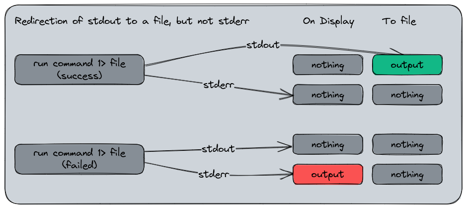

And now, in practice :

```bash
# I want to list the content of / and
# redirect stdout to a file named /tmp/stdout
$ ls / > /tmp/stdout
$ # Nothing's displayed on the terminal

# I show the content of /tmp/stdout
$ cat /tmp/stdout 
afs
bin
# etc.

# I do the same, but now I list the notexists directory
$  ls notexists > /tmp/stdout
ls: cannot access 'notexists': No such file or directory
$ cat /tmp/stdout 
$ # nothing
```

What did we seen here ? The output of the first `ls` was missing in the display since we redirected it into a file, so we had to read this file in order to see what we had. But, when we did the same for a the `notexists` folder, we still had the error output. That's because the stderr was not redirected.

The stderr can be redirected in the same way, but using the channel `2` to the redirection character : `command 2> /file`. In the previous example, we only specified `command > file` without indicating a channel number. That's because the stdout is the default one for a redirection. Can can also specify it if you want to avoid confusion : `command 1> file`.

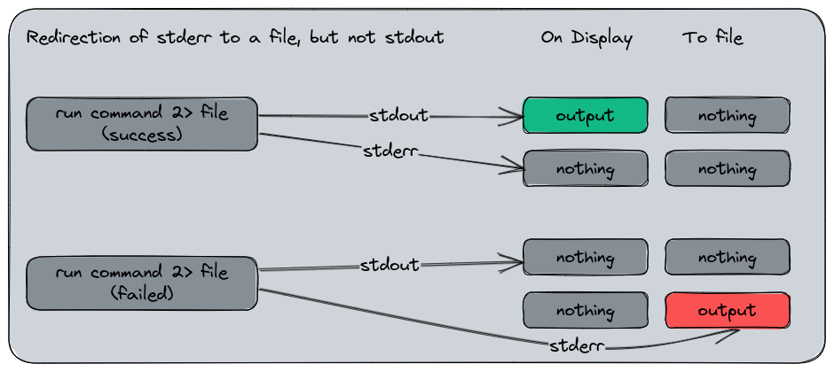

In this application exemple, we will redirect both channels to their respective file :

```bash
# I redirect stdout to /tmp/stdout
# and stderr to /tmp/stderr
$ ls /tmp > /tmp/stdout 2> /tmp/stderr

# Display the content
$ cat /tmp/stdout
# (various files listed)
$ cat /tmp/stderr
# (nothing)
```

Now we do the same for `notexists` :

```bash
$ ls /tmp/notexists > /tmp/stdout 2> /tmp/stderr

# Display the content
$ cat /tmp/stdout
# (nothing)
$ cat /tmp/stderr
ls: cannot access '/tmp/notexists': No such file or directory
```

Same result, but different, the stderr has been redirected to its own file with the error message, and the stdout file is empty since no output was provided from here.

Here is a representation of the redirection we did :

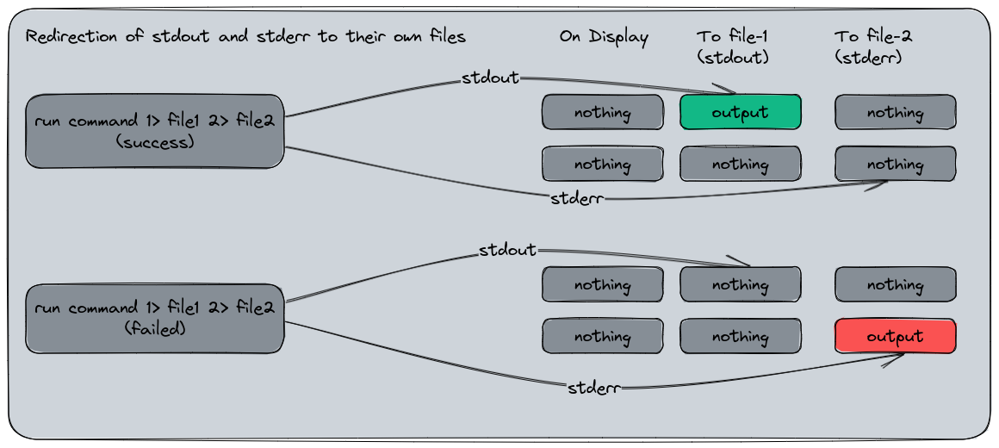

Now to put in application this use case in one command, we can list both `/` and `notexists` and redirect their streams to their respective file.

```bash
$ ls /tmp/notexists /tmp 1> /tmp/stdout 2> /tmp/stderr 
# (nothing's displayed)

$ cat /tmp/stdout
/tmp:
# /tmp content listed

$ cat /tmp/stderr
ls: cannot access '/tmp/notexists': No such file or directory
```

In this example, the output on the terminal is empty because we redirected both streams to a file, and we can see it by opened them.

A last use case commonly used is to merge stdout and stderr into the same data stream. To do this, we use a little barbaric syntax : `command > file 2>&1` which means : "Redirect stdout (>) to file and stderr (2) to (>) and combine it with stdout (&1)". The `&` symbol here is a reference to the stdout file descriptor in the system rather than a file name.

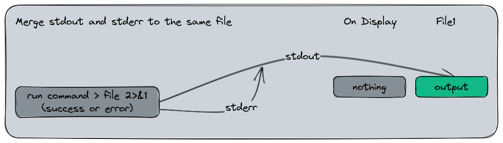

Let's show it in action :

```bash
$ ls /tmp/notexists /tmp > /tmp/stdoutanderr 2>&1
# (nothing's displayed)
$ cat /tmp/stdoutanderr
ls: cannot access '/tmp/notexists': No such file or directory
/tmp:
# /tmp content
```

### The tee command

Sometimes, you want to see your outputs in your display, and also redirect them to a file for a later logging. That the purpose of the command `tee`. `tee` is a command that reads the standard input and writes it to both standard out and one or more files. It's a very useful command when you have a program that writes a lot of data in the stdout and you want to analyse while it's executing without pausing it.

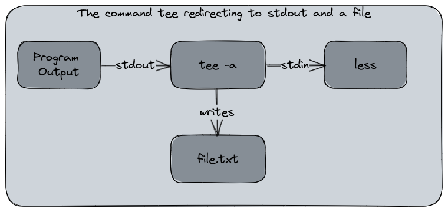

This command is usually used in the following way : 

```bash
program-with-verbose-output | tee -a logfile.txt
```
The `-a` argument is for `append` mode. By default, `tee` will replace the content of the target file. Using `tee -a` will append the output to the file.

To see this command in application, I'll do an example using an infinite loop displaying random data. This command means : "as long as 1 = 1, display 'hello' + a random number". 

```bash
$ while [ 1 = 1 ]; do echo " hello ! $RANDOM"; done
# (a flood of hello)
```

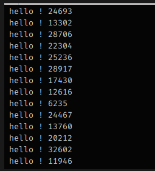

I run this command again with `tee` to register the output to a file :

```bash
$ while [ 1 = 1 ]; do echo " hello ! $RANDOM"; done | tee -a hello.txt
# (flood of hello)
# Interrupt command
$ ls -ltr
-rw-r--r--.   1 root   root   4028628 Feb 20 20:27 hello.txt
# tail is a command displaying by default
# the ten last lines of a file
$ tail hello.txt
 hello ! 29789
 hello ! 3627
 hello ! 24156
 hello ! 30467
 hello ! 1102
 hello ! 16939
 hello ! 28521
 hello ! 17224
 hello ! 4915
```

As you see, I've successfully registered my output while keeping the stdout flooding my terminal. Now let's append the `less` command to our flooding loop. `less` is a pagination command based on an older one, `more` able to read a file or an output and paginate it with the keyboard.

We will run the following command :

```bash
$ while [ 1 = 1 ]; do echo " hello ! $RANDOM"; done | tee -a hello.txt | less
```

And we have the following output :

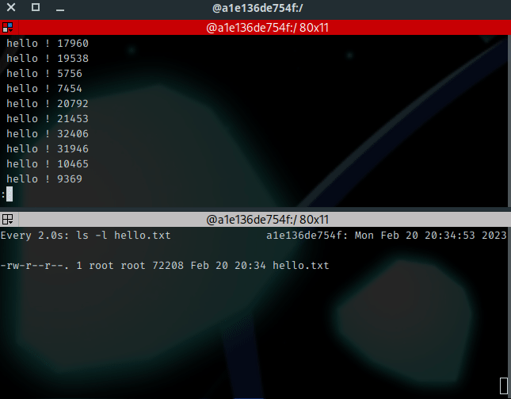

Some explanations : While using the `less` command, the output seems to be "frozen". Actually, the flood is still running, but the output is paginated. I've used the Page Up and Page Down keys to move into the output. Below this, a second session uses the `watch` command to display the size of the file named `hello.txt`. You may observe the content is growing : the output is redirected to `hello.txt` while I can read it properly on the terminal.

### Stdin redirection

Now we've seen how to redirect the stdout and stderr channels, let's talk about the stdin. Stdin is the input, usually the keyboard on the terminal. But, you can also redirect data streams to the stdin, in a reverse way. Instead of redirecting an output to a file, we redirect the content of a file to a command. Additionally, we can also redirect the output of such a command to another file. For stdin, the redirect character is `<`.

The `<` has a different behavior from its `>` counterpart :

- `<` alone will read the content from a file
- `<<` will read the content from the input line by line, with an "END OF FILE" - EOF - marker
- `<<<` will read the content from a string of characters

I want to know how many lines my infinite loop wrote in `hello.txt`. I can use the stdin redirect to ask the `wc` command to count. `wc` is a command able to return the number of characters, words or lines in a file. In our case, we use the `-l` argument that'll count the number of lines :

```bash
$ wc -l < hello.txt 
5492
```

Here, `wc -l` took the content of `hello.txt` as an input and return the number of lines as its output.

Now let's show how to use the `<<` redirect from a string composed of one or more lines. We call the `wc` command and specify `OEF` ('End of File') as an input terminator. The shell remains interactive until I've input `EOF`, then it executes the command.

```bash
$ wc -l << EOF
> one line
> two lines
> three lines
> EOF
3
```

You way wonder why the `wc -l` command sees 3 line while there are 4 ? Because `EOF` telling the command the file is complete. This line is ignored since it's an "end of file" signal.

The last operator, `<<<` read the input from a string of characters instead of a multi-lin input.

```bash
$ wc -l <<< "one two three"
1
# Since line count is not really relevant here,
# we switch to word count :
$ wc -w <<< "one two three"
3
```

For the last example, we will use stdin for input and redirect the output to a file.

```bash
$ wc -l < hello.txt > num_lines.txt
# nothing displayed
$ cat num_lines.txt 
5492
```

### The xargs command

Since we're talking about the stdin redirection, we can't ignore the `xargs` command. `xargs`, for "e**x**tended **arg**ument**s**", is made to build and execute commands from the standard input. This command is usually invoked after another one, using a shell pipeline, to pass the output of the first command to another one.

Example : I want to backup a photo folders to a backup storage. One possibility is to use the `find` command to search for images files and asking `cp` to copy them. `xargs` can be used to link them : 

```bash
$ find . -name "*.jpg" | xargs -P 24 -I {} cp {} /backup/
```

I must admit that `xargs` syntax is a quite of barbaric comparing to the various commands we displayed here. But let's try to explain it step by step.

```bash
# ask the find command to return all jpg files
# in the current directory (symbolized by the .)
$ find . -name "*.jpg"
./photo-31479.jpg
./photo-30466.jpg
./photo-10355.jpg
./photo-4337.jpg
./photo-20314.jpg
./photo-72.jpg
(...)
# returns a big list of files
```

The file list is then passed to `xargs` which uses two arguments in this case : 

- `-P 24` : execute up to 24 process in parallel
- `-I {}` : single argument, to replaces a string to a command input. In this case, each line (`{}`) returned by `find` will be sent to `xargs` and trigger a `cp` action
- `cp {} /backup/` : use the `cp` command to copy the line returned by `find` (`{}`) to `/backup`

Actually, `find` itself is already able to perform the copy action without `xargs`. This command will do the same :

```bash
$ find . -name "*.jpg" -exec cp {} /backup/ \;
```

But `xargs` has a little advantage : the `-P` argument I've used. This simple addition is nice to gain some time during a long execution because it will spawn several sub-process instead of a big recursive one. That's very useful when you're manipulating a lot of files.

Here is a comparison between `find` applying the `cp` command by itself (you may recognize the syntaxe to `-exec` is quite similar to `xargs`) and when it's processed by `xargs` with 24 sub-process using the command `time` to measure the execution duration for each. Note the difference between them for the "real" metric (which is the actual duration of the command from the input to the termination).

```bash
$ time find . -name "*.jpg" -exec cp {} /backup/ \;

real	0m21.981s
user	0m4.232s
sys	0m11.697s
$ time find . -name "*.jpg" | xargs -P 24 -I {} cp {} /backup/

real	0m4.472s
user	0m4.470s
sys	0m10.740s

```

The system activity was the following one :

Without `xargs` :

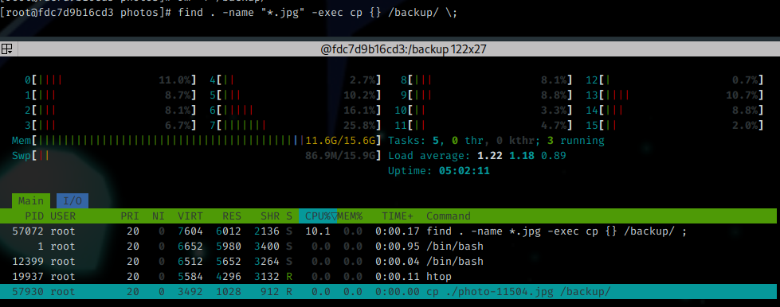

With `xargs` :

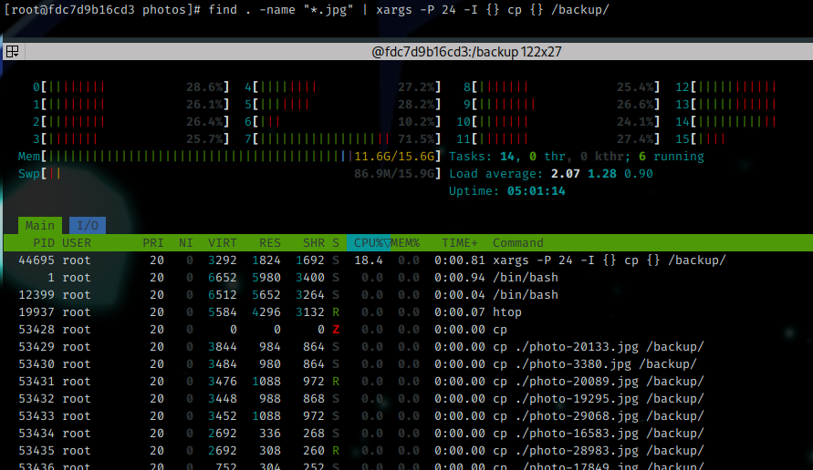


### A note about the unnecessary usage of cat

On Linux, there is a command we like to use a lot : `cat`. Unrelated to the domestic animal, its actual purpose of `cat` is to concatenate files into one by returning its output to the stdout. But it's very common to simply use it to display the content of one or several files directly in the stdout.

```bash
$ cat /etc/fedora-release 
Fedora release 37 (Thirty Seven)
# with two files
$ cat /etc/fedora-release /etc/hostname 
Fedora release 37 (Thirty Seven)
a1e136de754f
```

But sometimes, `cat` is used in an unnecessary way, such as the following ones :

```bash
$ cat /etc/filesystems | grep vfat
vfat 
$ cat file1.txt > file2.txt
$ cat file | less
```

These three commands examples have a useless complexity since they use `cat` while the stdin redirection is enough.

```bash
# grep can use a file as an input too
$ grep vfat /etc/filesystems
vfat
# or using the stdin
$ grep vfat < /etc/filesystems
vfat

# the content of file1.txt can be
# copied to file2.txt using cp
$ cp file1.txt file2.txt

# and using less with cat is .. useless
# less can take a file as an input too
# also the stdin
$ less file
# (...)
$ less < file
# (...)
```

## The shell pipelines

In a general definition for IT, a pipeline is a sequence of tasks performed by an information system to produce a result. It's similar to a workflow if you prefer. Typically, in Continuous Integration and Delivery, we talk about "CI/CD pipeline" for the complete process that manages the build and delivery (and possibly more actions) of a software.

For shell, a pipeline is the usage and chaining of at least two shell commands into a single input that use the output of the previous one to perform a task. We've seen some examples in this chapter actually, without naming them :

```bash
$ while [ 1 = 1 ]; do echo " hello ! $RANDOM"; done | tee -a hello.txt
$ cat /etc/filesystems | grep vfat
$ cat file | less
```

These three examples are shell pipeline. They're recognizable by the usage of the pipe `|` character. These pipelines allow to create a [one-liner program](https://en.wikipedia.org/wiki/One-liner_program), a program that performs its action with only one line of code. The one-liners are quite a special culture in the shell scripting word, with a lot of challenges to perform complexe tasks in one line of code. That's a complexe and intellectually rewarding effort, but sometimes it can also be very difficult to read and understand.

Here is the workflow used by the Shell to process this command : 

```bash
cat /etc/filesystems | grep vfat
```

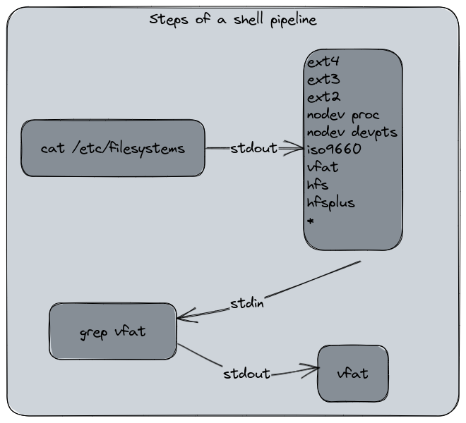

The `cat` command returns the file content. The content is redirected to the `grep` stdin channel and the command outputs its final result. The user did not see the transformation.

Now let's use a more practical example of shell pipeline. Use-case : I want to extract for GitHub's meta API the IPv4 subnets for the API service. 

The API URL is the following one : https://api.github.com/meta

I'll need three commands :

- `curl` : a library for manipulating HTTP requests
- `jq` : a command that parses and manipulate JSON data
- `grep` to filter the IPv4 subnets with a regular expression

Let's build the pipeline.

```bash
# First, we get an output from curl
# We use the --silent argument to ensure the output
# won't be polluted
$ curl --silent https://api.github.com/meta
{
  "verifiable_password_authentication": false,
  "ssh_key_fingerprints": {
    "SHA256_RSA": "nThbg6kXUpJWGl7E1IGOCspRomTxdCARLviKw6E5SY8",
    "SHA256_ECDSA": "p2QAMXNIC1TJYWeIOttrVc98/R1BUFWu3/LiyKgUfQM",
    "SHA256_ED25519": "+DiY3wvvV6TuJJhbpZisF/zLDA0zPMSvHdkr4UvCOqU"
  },
(...)

# Now we need to filter the JSON output for the
# API entries only

$ curl --silent https://api.github.com/meta | \
jq --raw-output ".api[]"
192.30.252.0/22
185.199.108.0/22
140.82.112.0/20
143.55.64.0/20
2a0a:a440::/29
2606:50c0::/32
20.201.28.148/32
20.205.243.168/32
102.133.202.248/32
20.248.137.49/32
20.207.73.85/32
20.27.177.116/32
20.200.245.245/32
20.233.54.49/32

# In this pipeline, the curl's stdout has been piped
# to jq's stdin
# jq's stdout is the pipeline output

# Now, we apply the grep pattern to filter only the IPv4
$ curl --silent https://api.github.com/meta | \
jq --raw-output ".api[]" | \
grep -E '([0-9]{1,3}\.){3}[0-9]{1,3}/[0-9]{1,2}'
192.30.252.0/22
185.199.108.0/22
140.82.112.0/20
143.55.64.0/20
20.201.28.148/32
20.205.243.168/32
102.133.202.248/32
20.248.137.49/32
20.207.73.85/32
20.27.177.116/32
20.200.245.245/32
20.233.54.49/32
```

And here we are : in one pipeline, I've been able to extract the IPv4 subnets for GitHub's API service using its public "meta" API as a source.

In this pipeline, `curl`'s stdout is piped to `jq`'s stdin. `jq'`s stdout is then piped to `grep`'s stdin which applies the search pattern. `grep`'s stdout became the final output for the command on the terminal.

About the `\` notation you've seen here : for a better readability purpose, or display reasons such as this website, it's a good practice to use this escape character for splitting to several lines your shell command.

### Chaining with conditions

Another useful element in shell scripting is the possibility to chain and condition the execution of commands in a pipeline. If a command succeed, we play the next one. If not, we play another one later. To achieve this, we use these operators :

- `&&` : means 'AND', will be executed only if the previous command is a success
- `||` : means 'OR', will be executed only if the previous command is a failure

Here is a pipeline I use a lot to test if a network port is opened without the requirement of install a specific command (or being unable to do it). It's a combination of this article and the information of the previous one when we said : "On Unix, everything's a file !" :

```bash
$ timeout 1 bash -c "</dev/tcp/zedas.fr/443" && echo OK || echo KO
OK
$ timeout 1 bash -c "</dev/tcp/zedas.fr/4443" && echo OK || echo KO
KO
```

What did we do here ? With this command, I've been able to see if my website answers on port 443 (which is the HTTPS port) and 4443. The result for 443 was OK (if not, you'll had difficulties to read this page) meanwhile the 4443 was a failure and returned "KO". `timeout` is a command used to specify a timeout duration for an input. I've used it because I didn't want to wait for the default bash timeout.

Here is this code explained :

- `timeout 1` : wait for the command completion until 1 second, and stop it
    - `bash -c` : use `bash` to run the following command
        - `</dev/tcp/zedas.fr/443` : use the `/dev/tcp` pseudo-file of Bash to open a network connection to `zedas.fr` on port `443` (and 4443 in the second example) by reading from the stdin the "file" content
        - `&& echo ok` : If the bash command is a success, return "OK" in the terminal
        - `|| echo ko` : if the bash command is a failure or interrupted by `timeout`, return "KO" in the terminal

Please note that `/dev/tcp` is a bash-specific feature. On, Zsh it won't work :

```bash
$ echo $SHELL
/usr/bin/zsh

$ </dev/tcp/zedas.fr/443 && echo ok
zsh: no such file or directory: /dev/tcp/zedas.fr/443

$ bash -c "</dev/tcp/zedas.fr/443" && echo ok
ok
```
