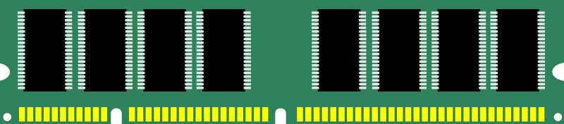
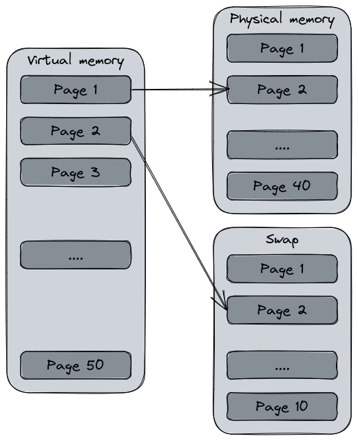
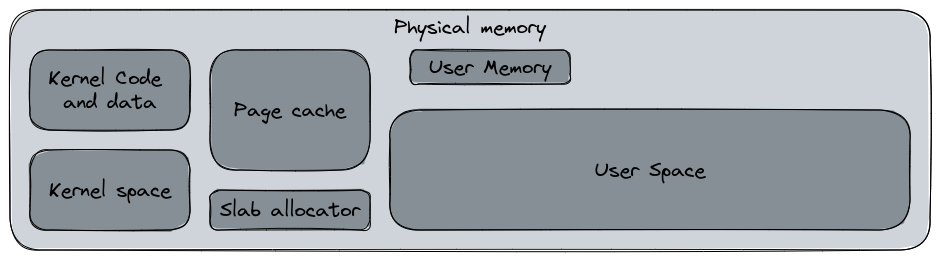
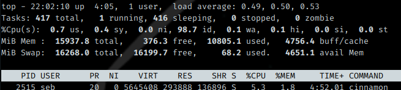
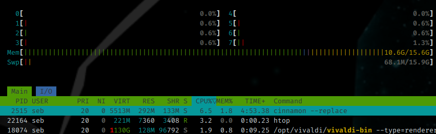

# Chapter 7 : The Memory management

## What is the memory for an operating system

The memory management is a critical aspect of an operating system. It's goal is to provide a dynamic way to allocate the portions of the system's memory when a process request it and free it when its task is over and reuse it for new tasks. The memory management is one of the keys of the system's stability. But, what is the memory for an OS ?

In your computer, or your smartphone, technical sheet, you have a criteria named "Memory" or "RAM" with a value, usually in Gigabytes (GB). The RAM, for Random-access memory, is a volatile memory attached to a computer's motherboard. It is usually made of standardized circuit boards having several integrated circuits that represents the storage capacity. The purpose of the RAM is to store system and application's data that must be quickly accessed. For example, your web browser's tabs content will be stored in RAM because it's faster than writing their contents to the disk.



Image from [OpenClipArt](https://openclipart.org/detail/25792/ram-computer-memory), public domain.

The RAM is volatile (but it exists some non-volatile variants we won't talk about here), which means its content is lost when the memory card's power supply is cut off. That's the opposite with your computer storage, such as the hard disk drive (HDD) or the solid-state drive (SSD) that keep their content after the system being turned off. 

Because it's a limited resource, its management is a critical process for an OS kernel. The Kernel itself has routines and procedures to ensure the system's memory will remain available in an acceptable way and there are no non-running process that occupy the memory for nothing. But it's also a critical task in software development because the program must use the memory in a efficient way. It's a shared responsibility.

Understanding how Linux manages the system's memory is important for a system administrator to help optimize the system performance, troubleshoot issues, and ensure the applications are running as efficiency as possible.

## How Linux manages the memory

Linux has a well furnished toolbox for memory management, but first let's put some definitions with the memory hierarchy.

### Memory hierarchy

We can usually identify four main types of memory in Linux :

1. Physical memory : This is the RAM installed in the computer, which stores the running processes data and the kernel itself.
2. Swap memory : This is a virtual memory used for overflow unloading when the physical memory is running low. The kernel moves the less frequency used pages of memory from the physical to the Swap (which is usually the hard drive) in order to free some RAM
3. Kernel Memory : This is a part of the physical memory, reserved for the use of the Kernel. This space is reserved to its exclusive usage for its own tasks and data.
4. User-space memory : This is the memory used for the user-space applications, where any user processes are working.

### Memory Pages

Do you remember the filesystems description ? A filesystem is a logical representation of the physical storage, cut into several blocks of the same size that are allocated to store data. The system's memory works in the same way, that's the pages.

In Linux, the memory is managed in pages, a contiguous block of memory of fixed size, usually 4KB, that the operating system uses to store and manage data. Just like the file allocation table in a filesystem, the RAM pages have a unique virtual address assigned.

The pages are managed by the kernel's memory manager, responsible for keeping track of the used and available pages in the memory. This manager is also responsible of unloading less accessed pages content to the disk into the Swap memory and reloading them when the content is requested.

The pages can be opened in read-only mode and write mode depending of the current request. A data storage request will open the page in write mode while a program execution will open it in read-only.

### Virtual memory

The virtual memory is actually how Linux manages the memory. It's a core concept in modern operating systems since it uses both the physical memory (RAM) and the mass storage (hard drive, SSD...) into a logical representation of the total system's memory. The disk storage is what we call the Swap partition.



Just like the physical memory or the filesystem, the system establish an address allocation for each memory page of the virtual memory that the process may use. The virtual memory creates the illusion that the system has a large memory resource than its actual one. 

One of the most interesting feature of the virtual memory is the address swapping. The swap is a filesystem partition usually created during system installation that is added to the virtual memory capacity. Since it's a slower memory than the RAM, it's main purpose is to unload pages from the RAM to the disk in order to free the physical memory. This is what we call the swapping. Having a system that "swaps" a lot is usually a witness of an over usage of the physical memory and can slow down the overall performance since the kernel will require time to bring back the pages into the RAM and discharge them.

Today, since our computers are using more and more the SSD, the usage of the Swap partition is matter to debates since these supports has a limited write endurance compared to the hard disk drives. If the system has enough RAM, the Swap partition would not really be relevant. If the Swap is required in the configuration, one possibility to avoid overusing the SSD would to use the zram or zswap features that compress the memory pages in RAM rather than writing them on disk.

## Memory allocation

The memory allocation is the process of allocating the physical memory to the different areas of the system. When the system starts, Linux will allocate some "regions" in the memory for specific usage. The following diagram represent some of the keys items of the memory allocation with their respective (rough) distribution.



- Kernel space : this is the space reserved for the Linux Kernel and its drivers. This space typically includes the kernel code, data structures, and other kernel-related data. In this space, the kernel manages its own memory allocation according to specific mechanisms.
- User space : this space, usually one of the widest, is available for the user application. This space is usually managed by `malloc()`, a C library dedicated to the memory allocation for programs. Other libraries can perform this action too. The user memory space is the memory allocated to a user space process. These memory spaces are separated in their own sandbox. A user process cannot access to the user memory of another process unless explicit approval.
- Page cache : this cache section contains the recently accessed files stored in memory to improve file access performance. This space is managed by the kernel's page cache management system.
- Slab allocator : This memory allocation mechanism is used by the kernel to allocate small to medium sized data type objects such as data structures, network buffers or file system buffers. Its role is to reduce the CPU time costly action of initialize and destroy kernel data objects and reuse them.

During its usual working routine, a process will request for a specific amount of memory using the `malloc()` or equivalent function. However, if the system runs out of memory, another protection routine is triggered : OOM (Out Of Memory) Killer. The purpose of this protection is to free enough memory to preserve the system's stability and avoiding it to crash, meanwhile stopping a non critical process to avoid service disruption. OOM killer will inspect the running processes and will determine, according to several factors (uptime, last restarted, is it a critical process, etc), which process [can be killed](https://turnoff.us/geek/bad-malloc/) to free some memory for the system. 


## Common memory issues

The memory management is a complex operation involving various mechanisms.

### Fragmentation

The memory fragmentation is a consequence of the memory pages usage. Since the memory is divided into numerous 4KB blocks, just like a filesystem, when a process request some memory allocation it will request *n* blocks of memory. When the system's startup time is recent, the blocks allocated are contiguous. But after a lot of allocation and restitution, the memory is getting fragmented. The small blocks are more non-contiguous and scattered throughout the memory regions.

This behavior can provoke issues, such as the system being unable to properly satisfy the memory allocation requests because the quantity of contiguous blocks is reducing. This is also a criteria for OOM Killer trigger, that can kill processes in order to reclaim memory blocks. One of the other impact is a possible degradation of the system's performances.

Since the memory fragmentation is a system management issue, Linux uses various techniques to mitigate this issue. The kernel is able to compact and perform defragmentation on the memory to recreate contiguous memory regions. The memory compaction moves pages in the memory to create larger free regions.

### Memory leak

The memory leak is another problem which is mostly caused by software development. This issue occurs when a process continually requests memory allocation without releasing it. The result could be degraded system performances or even system crashes if OOM Killer cannot free enough memory to ensure the system's stability.

Since it's usually a programming issue, there are various ways to prevent it. Some tools and development assistant such as linters or code analysis solutions can provide tips to prevent potential memory leaks. Also, some programming languages interpreters can free by themselves the unused memory thanks to garbage collection routines. For other languages, the developers will have to ensure they properly allocate and release the memory.

## How to check the system's memory usage

### Reading files and basic commands

We will repeat this mantra a lot of time : "On Unix, everything's a file". No exceptions here, the memory usage can be consulted by reading some files. This one is called `/proc/meminfo`.

```bash
$ cat /proc/meminfo
MemTotal:       16320324 kB
MemFree:          167392 kB
MemAvailable:    5161132 kB
Buffers:          143064 kB
Cached:          4649696 kB
SwapCached:           24 kB
Active:         13241624 kB
Inactive:        1248668 kB
Active(anon):    9751948 kB
Inactive(anon):   126100 kB
Active(file):    3489676 kB
Inactive(file):  1122568 kB
Unevictable:        6192 kB
(..etc)
```

I will not detail all of these results. For a simpler and better understandable view, you can use the `free` command. The `--mega` argument displays the result in megabytes : 

```bash
$ free --mega
               total        used        free      shared  buff/cache   available
Mem:           16712       11377         263         165        5071        4820
Swap:          17058          72       16985
```

We have here six sections which are :

- Total : The total installed memory on the system. "Mem" is the physical memory, the RAM, and "Swap" the swap partition.
- Used : The currently used memory, calculated as **total - free - buffers - cache**.
- Free : The unused memory.
- Shared : The shared memory, mostly used by the tmpfs, the `/tmp` directory stored in memory instead on disk.
- Buff/cache : The sum of Buffers and cache.
    - Buffers : The memory used by the kernel buffers, some data temporary stored in memory waiting for being written on disk.
    - Cache : The cached recently accessed files for accelerated consultation.
- Available : An estimation of the currently available memory without swapping, taking into account the page cache and the non reclaimable memory slabs.

As you may have seen, the Swap has only three fields. That's because the shared, buffers, and caches are RAM-exclusive sections since the Swap is only a secondary storage for memory discharge.

A question you may ask is :

> 293MB free since you're displaying having a total of 16GB and using 11GB ?

In its memory management, Linux hates wasting memory and will always use it for caching and buffering data. So, if I actually use 10GB memory, the 5 remaining GB are used for the caching and the buffers. If the system needs to use more memory for the process, it will reclaim some cached memory and allocate it to the process.

About my Swap partition, it is split into two actual partitions. We can see it with the `swapon --show` command.

```bash
$ swapon --show
NAME       TYPE      SIZE  USED PRIO
/dev/dm-1  partition 7.9G    0B   -2
/dev/zram0 partition   8G 68.3M  100
```

In my case, my Swap partition, offering a capacity of 16GB, is split into two almost equal parts : 

- `/dev/dm-1` is a filesystem on my disk with a very low priority (because it's a SSD, I haven't setup my partitions during the initial install and Fedora did it by itself). 
- `/dev/zram0` is a compressed block device in RAM using a virtual filesystem, managed by a kernel module. This feature allows the system to store pages out of memory in compressed form in a dedicated area of memory called the zswap cache. This is an alternative to avoid using the expensive I/O operations from disk, and it improves system performances

### Using top or htop

Additionally to `free` and the various system files, there are two useful command to see your system status, including the memory usage. `top` is a command created in 1984 for Unix and included in Linux too, usually preinstalled. Unlike `ps`, another command that shows the system processes and resources usage, `top` is interactive and provides an almost real time refreshing display.



`top` displays the CPU and memory usage, and also the load average, number of connected users, and so on. As you can see, the output is similar to `free` for the memory part.

A quick word about the load average. This is a numerical representation of the workload on the system over a period of time. This measure indicates how many processes are currently active in the system and how many are waiting for CPU time or I/O operation to execute. The three metrics are over the last 1, 5 and 15 minutes. The higher the load average is, the more the system is loaded and can become slow or unresponsive if too high. This metric is affected by the number the CPU, the amount of memory and the type of applications running on the system. This is one of the typically supervised metrics on Linux.

`htop` is another interactive system process viewer developed in 2004 that returns a more user friendly and visual output than `top`. But unlike `top`, `htop` is not usually preinstalled.



In this tool, you can directly see the CPU activity per core or thread, and the memory usage. The memory usage line is colored with three colors : green is the used, blue the buffers, yellow the cache.

In these two commands, we have three interesting metrics : VIRT, RES and SHR.

- VIRT : Virtual Memory, the total amount of memory that a process is using, including both physical (RAM) and virtual (swap space). This metrics displays all the memory a process can potentially access, even if it's not currently in use.
- RES : Resident Memory, the amount of physical memory (RAM) that a process is currently using. It does not include the virtual memory swapped out. RES is the actual memory used by the process that cannot be user by other processes.
- SHR : Shared Pages, the amount of shared memory used by a process. This is a technique allowing two or more processes to share the same memory segment in order to reduce the amount of memory used by the overall system.

In the two screenshots, you see the `cinnamon` desktop environment main process using 5GB of VIRT memory, but actually it uses 292MB of physical memory and shares 133MB memory with other processes. 

