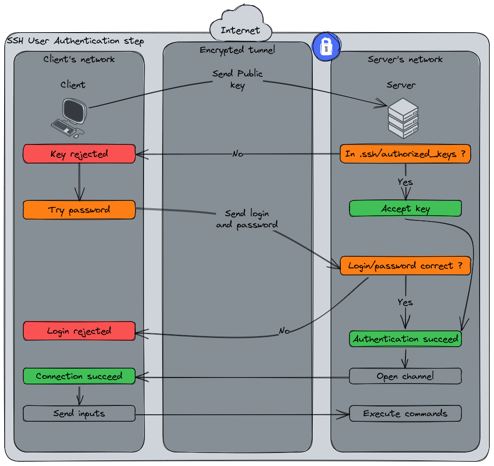
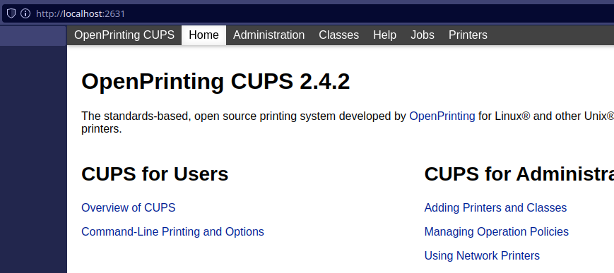

# Chapter 8 : Remote access with SSH

## From RSH to SSH

The Remote Shell, or `rsh`, is a command line computer program created in 1983 as a part of the Berkeley "*[r-commands](https://en.wikipedia.org/wiki/Berkeley_r-commands)*" - r for remote -, released for the first time in 1981, made to enable the users of an Unix computer to connect to another one using the network. Aside `rsh`, this set of commands includes tools for remote file copy (`rcp`), remote file synchronization (`rsync`), remote execution (`rexec`), etc.

The *r-commands* were a nice innovation and became *de facto* standards commands for Unix. However, with the development of the Internet and the usage of remote network, their security became a concern since the data were transmitted in clear text across the network, including the login identifier and password. Also the passwordless authentication method was very weak and relied on the honesty of the configuration.

So, to address these issues, a secured version of the protocol has been developed, the Secure Shell, or SSH, published for the first time in 1995.

Like `rsh`, `ssh` is a client server protocol made to open sessions on a remote system. But, unlike `rsh`, `ssh` uses cryptography to encrypt the network activity of its protocol. This protocol is a standard since its large adoption that replaced the unsecured remote shell.

Today, one of the most common implementation is the [OpenSSH](https://en.wikipedia.org/wiki/OpenSSH) version, released in 1999 and forked from the original SSH protocol while it was still a free software before being transformed into a commercial product. The protocol is generally referred by the name SSH-1 and SSH-2 meaning the major version of its implementation. SSH-2 has been developed by OpenSSH as a revisited version and the protocol also implemented backward compatibility with SSH-1. Today, SSH-1 is deprecated and should not be used. OpenSSH definitely expunged its support from the code base with the 7.6 release in 2017.

## SSH Architecture

SSH relies on the public-key cryptography to authenticate the remote system and allow it to authenticate the user trying to connect on it. SSH works on three hierarchical layers : 

- Transport layer : provides the server authentication, confidentiality and integrity, it also exposes the reserved port 22 used by default for the protocol
- User authentication protocol : validates if the user is known by the server and the credentials are correct by testing a suite of user-authentication algorithms
- Connection protocol : multiplexes the encrypted client server communication tunnel into several logical communication channels

Here is a first diagram explaining the summarized steps made during the SSH connection initialization.


Here is the detailed steps :

1. The client initiates a TCP connection to the SSH server on port 22 (default reserved port).
2. The server responds to the client's connection and they establish a TCP handshake.
3. The server sends its identification string to the client with various informations (protocol version, etc).
4. The client sends its own identification informations to the server using the same format.
5. Once the identification strings have been exchanged, the server sends its public key to the client.
6. If the server is not in the "known_hosts" file of the client, it will prompt the user if they can trust it or not. If yes, the server will be added into the list.
    - If not, this question will prompted everytime
7. The client generates a random session key and encrypt it with the server's public key.
8. The server decrypts the session key using its private key.
9. The connection between the client and the server is now secured by encrypting each data using the session key.

Then, the user is authenticated. This diagram displays the two authentication protocols : pub key then password.



Authentication steps :

1. The client sends its authentication information to the server. Example here : its public key.
2. The server verifies is the public key is in the "authorized_keys" according to a deductive pattern.
3. If the client's public key is not authorized, the server rejects it and notify the client.
4. The client tries to authenticate using the username and password.
5. The server validates the provided credentials.
6. The client and servers can now exchange data and commands in a secured encrypted way.


## Authentication methods

SSH supports two authentication methods : the Public key and the Password.

### The public key authentication

The public key is the most preferred method. The server possesses a list of authorized keys in a file judiciously named `authorized_keys`. This file can be present at different places we will see in the configuration chapter. These keys are the **public keys** of the users allowed to connect on the server. The users have their own **private key** and they keep it secret. Let's have a word about the public key cryptography notion.

The public key cryptography, also called asymmetric cryptography, is a field of cryptographic systems that use a pair of related keys : the public and the private. The public key is, as its name indicates, a public data than can be exchanged with anyone since these people will have to use it to encrypt the data. The private key is, on the opposite, a confidential data that must be owned only by the recipient of the encrypted data since it's the only way to decrypt it.

If I would try to use a metaphor, the public key would be a box in which you can store the message you want securely transmit that you would lock with the public key. Once you've locked the box, it would be impossible to reopen it unless you would have the private key.

*Since I'm not a cryptography expert, please restrain yourself from throwing stones at me if this part is over simplified.*

During public key authentication, the SSH server will verify if the provided public key matches with the entries declared in `authorized_keys`. If yes, it will generate a random string of data and encrypt it with the client's public key and send it to the client. This method is called "sending a challenge". The client decrypts the challenge with its private key and sends it back to the server. Eventually, the server compares the challenge sent by the client with its local version. If they hopefully match, the server assumes the client possesses the corresponding private key of the public key and authenticates the client.

If the public key is not in the `authorized_keys` file or if the challenge doesn't match, the server will denies the connection.

[OpenSSH supports](https://man.openbsd.org/sshd#AUTHORIZED_KEYS_FILE_FORMAT) various public key algorithms :

- sk-ecdsa-sha2-nistp256\@openssh.com
- ecdsa-sha2-nistp256
- ecdsa-sha2-nistp384
- ecdsa-sha2-nistp521
- sk-ssh-ed25519\@openssh.com
- ssh-ed25519
- ssh-dss
- ssh-rsa

RSA is one of the most common key algorithm supported by nearly all SSH clients and servers. ECDSA and EdDSA are more recent algorithms that provide better security and performance.

### The password authentication

The password authentication is basically the same method as authenticating locally on the computer and will follow the same workflow as the pattern we described in [Chapter : 5 User management](/posts/linux-explained-5-user-management/).

Once the secured tunnel is setup by the SSH connection, the user sends its username and password. Then, the usual Linux login process is executed and the server authenticates the user.

Since the password-based connection is reputed less-secured than the key-based authentication and vulnerable to brute-force attacks or password sniffing, it is not the preferred neither the recommended one.

## SSH configurations

Both SSH client and server can have specific configurations, let's take a tour of these files.

### Server configuration

The main server configuration file is located at `/etc/ssh/sshd_config`. The default installation usually setup the server in a proper configuration for security, but some parameters should have a review.

Some interesting configurations to review :

- `PermitRootLogin` : this setting should be set to "No", disallowing the direct connection with `root` user.
- `AuthenticationMethods` and `PubkeyAuthentication` : these two settings can restrict the password connection method and allowing the users to authenticate only with key-based authentication.
- `AllowUsers` : A good security setting is to set a list of explicitly approved users.
- `ClientAliveInterval` and `ClientAliveCountMax` are good settings to disconnect idle users.

In `/etc/ssh` you can also find the `/etc/ssh/ssh_config` file that manages the system-wide settings for the SSH client.

It is also in `/etc/ssh` where you can find the server's private and public keys, for each key generation algorithm supported. The access to these files are restricted to `root` and the sshd daemon.

Finally, one of the most important file to setup an SSH connection is the `authorized_keys` file. This file is expected to be in the home directory of the user in a sub directory named `.ssh` : `~/.ssh/authorized_keys`. It only contains a list of authorized public keys for authentication purpose, one key per line. For security reasons, the permissions of the file must be restricted and cannot be too opened or the ssh daemon will refuse the access.

### Client configuration

The first interesting configuration file on the client side is `/etc/ssh/ssh_config`, we described in the previous section. This configuration file defines system-wide parameters for the client such as the preferred authentication method, etc.

The system-wide configuration can be customized by the `~/.ssh/ssh_config` file present in the user's home directory. This file takes precedence over the system configuration. The client's config can contains specific connections settings that can be traditionally passed through the command line For example, if you have several private keys for your connections or if the connection user is different from your current one, you can define them such as : 

```bash
Host host1
  User someuser
  identityFile ~/.ssh/id_rsa_host1
  
Host host2
  User someuser
  identityFile ~/.ssh/id_rsa_host2

# A practical example :
# I have a dedicated SSH key for GitHub,
# and another one for Codeberg

Host github.com
	IdentityFile ~/.ssh/id_rsa_github

Host codeberg.org
        IdentityFile ~/.ssh/id_rsa_codeberg

```

The `~/.ssh` folder also contains the user's private and related public keys for connection. Just like the server, its permissions must be restricted to the user only or the SSH client will refuse to use them.

One last file is the `~/.ssh/known_hosts` that contains the list of trusted hosts (the one you had to answer "yes" at the first connection). This file contains the server's full hostname and its public key. One of the interests of this file is to keep a track of the server's identity. Imagine your server is a virtual machine you can destroy and recreate at will. Since the server's key will be regenerated during its recreation, the SSH client will alert the host key mismatch the known host. This is a protection against keys hijacking and man-in-the-middle (MITM) attacks. Please note that if there is a MITM during the first connection and you trust it, it may be able to bypass this security feature.

## Useful features

Aside its primary usage, SSH, possesses some nice features for a system administrator.

### Port forwarding

The port forwarding is a feature that allow a client to forward the traffic on a specific port to the server's through the SSH connection. Let's say you have a printing server - Cups - on which one you want to access its GUI. You can't access to the port 631 (the Cups GUI port) from your network because reasons, but you can access the server with SSH. In your command, you can forward the 631 port to another local port (let's say 2631).

To do this, we use the `-L` argument to the command, which uses the following syntax : 

```bash
ssh -L {LOCAL_IP}:{LOCAL_PORT}:{DEST}:{DEST_PORT} username@server
```

- `LOCAL_IP` is the local machine IP address. It is usually omitted because by default it will bind to `localhost`
- `LOCAL_PORT` is the local port listen on the local machine from which SSH will forward the traffic to the remote machine
- `DEST` : this is the IP or hostname of the destination machine. Usually, `localhost` is enough but depending of the service, you may need the full hostname.
- `DEST_PORT` : the port on the remote machine you want to forward to

In my example with Cups :

```bash
$ ssh -L 2631:localhost:631 192.168.2.45
```

If I open the browser on my machine and go to http://localhost:2631, I'll have the Cups GUI.



You may specify as many port forwards as you need in the `-L` argument :

```bash
$ ssh -L 2631:localhost:631 2632:localhost:632 192.168.2.45
```

The port forwarding can also works in the opposite way : forward a port on the remote host to a port on the client machine. Let's do the same with my Cups server example.

```bash
$ ssh -R 2631:localhost:631 192.168.2.45
Last login: Sun Mar  5 21:43:01 2023
$ curl http://localhost:2631

<!DOCTYPE HTML>
<html>
  <head>
    <link rel="stylesheet" href="/cups.css" type="text/css">
    <link rel="shortcut icon" href="/apple-touch-icon.png" type="image/png">
    <meta charset="utf-8">
    <meta http-equiv="Content-Type" content="text/html; charset=utf-8">
    <meta http-equiv="X-UA-Compatible" content="IE=9">
    <meta name="viewport" content="width=device-width">
    <title>Home - CUPS 2.4.2</title>
  </head>
(...)
```

### Route traffic through SSH tunneling

In the SSH definition, we said that the protocol establish an encrypted tunnel between two hosts. One of the neat features available with SSH is that you can redirect your web traffic through the tunnel using it as a proxy. This setup require some configuration but not that much.

First, you need to open a connection to your remote server that will play the proxy role.

```bash
$ ssh -D 5555 -f -C -q -N user@server
```

Explanation of these arguments :

- `-D 5555` : Tell SSH to open a SOCKS tunnel on the specified port number. In my case, I use the 5555.
- `-f` : Forks the process to the background, don't keep an interactive shell.
- `-C` : Compress the data before sending it, nice to save some network bandwidth.
- `-q` : Use quiet mode, SSH won't display anything
- `-N` : No command will be sent once the tunnel is opened

When you executes this command, it's like it stopped but that's not the case. The ssh process is running in background.

```bash
$ ps -afe|grep ssh
seb         6470     684  0 22:21 ?        00:00:00 ssh -D 5555 -f -C -q -N user@server
```

You can terminate it using the `kill` command and its Procss ID (here : 6470).

```bash
$ kill 6470
# will terminate the ssh tunnel
```

But not now. Let's open Firefox because it's simpler to demonstrate the behavior with it.

I open https://whatismyip.com to check how I'm seen on the Web.


Now, open Firefox's settings and search for "proxy". Open the network settings.


Enable the Proxy in Manual mode. Then, in the SOCKS field, I've set the host to "localhost" and the port to "5555" (which is the socket listened by SSH).


Now I reopen whatismyip.com and what can I see ? Since I've opened a connection to one of my OVHCloud VPS hosted in the German datacenter, now the Web "sees" me in Germany coming from the OVH network.


Of course, this feature is only possible when you're able to connect on a remote SSH server. This possibility is usually described as a way to avoid the proxies on an enterprise network, but the companies will also usually block other ports that are not HTTP or HTTPS, so opening a SSH tunnel may be difficult on their network. But it can be useful to use it on an untrusted network such as a public Wi-Fi.

## Some security practices

This last part will talk about the security for SSH. Since it's a network protocol that plays a critical role, its security must be enforced. Here is some common advice regarding how to secure a SSH server and client. Of course, this list won't be exhaustive.

### Use key-based authentication and strong passwords

The key-based authentication is more secure than a username and password since it relies on a secret only known by the client and there are no password to type on a prompt after the initial setup. This said, in any cases, the user account must still have a strong password randomly generated to ensure it would not be vulnerable to a dictionary or brute-force attack.

However, a SSH key can also be stolen. That's why a good practice is to associate a passphrase to unlock the key. When using the key, a passphrase will be prompted to unlock it before establishing the connection. This passphrase remains on the client's side and is not sent to the network since it's just a local unlock sequence, so a man-in-the-middle attack should not be able to intercept it unless the client is infected by a keylogger.

Once the SSH server is setup and the keys exchanged, the password method should be disabled allowing the users to only authenticate with keys. Please keep in mind that unless you have access to the server's console, the users may lost their access if they lose their keys.

This is the following settings in `sshd_config` :

```bash
    AuthenticationMethods publickey
    PubkeyAuthentication yes
```

You may also disable the Empty Password users, this will disallow remote login with these kind of accounts. This is disabled by default in OpenSSH config.

Again, the users passwords and the SSH keys passphrases should be strong enough to resist to brute-force attacks and should be randomly generated (a password manager like KeepassXC is your best friend) to ensure they're not in a dictionary.

### Disable root login, restrict authorized users

That's one of the first thing to verify : ensure `root` cannot directly login to the server. This can be achieved by modifying the following setting :

```bash
    PermitRootLogin no
```

A good practice is also to allow a specific list of users or groups. If you're able to manage at user-level, you can use the directive `AllowUsers` in `sshd_config`. However, creating a group of authorized users and adding it in the `AllowGroups` directive may simplify the administration tasks. On the opposite, the `DenyUsers` and `DenyGroups` can enforce the authorized users list. The settings are processed with Deny list first, then Allow.

You may additionally set the client idle timeout with the settings `ClientAliveCountMax` and `ClientAliveInterval` to disconnect inactive sessions.

If the use case permit it, you can lock down the users to their home directories using the `chroot` option. `chroot` is one of the oldest process isolation method embedded in Linux. By activating the `ChrootDirectory` option on the SSH server, the users won't be able to leave their home directories since the session will be locked to a specific directory tree. This use case is recommended for file transfer such as using sftp servers to ensure the user account is unable to go elsewhere. It's also a nice way to reduce the attack surface in case of account compromission.

### Using a ssh bastion host

A SSH Bastion, or Bastion Host, is a server with a specific purpose : being the gateway to your SSH hosts. You may find these kind of server in enterprise context. They're jump server used to access to remote environment without being able to access them directly. In this architecture, the hosts are inside a closed network bubble and the jump server is the only one allowed to access to them. 


A usual SSH Bastion network architecture.

In the classical workflow, the SSH Bastion is a software maintaining a database of user identities allowed to impersonate user accounts on servers that will grant them the expected permissions. For example :

- A system administrator may land on the servers with an account permitting the necessary privilege escalation to perform administrative tasks on the system
- A level one technician may land with a limited account allowing them to perform the required tasks according to the procedure they have to follow
- A database administrator may be able to access with an account permitting database administration tasks, but not system administration

This principle is called the **least privilege policy**. This concept aims to restrict the permissions of a user to the strict necessary allowing them to perform their tasks. It's a security practice aiming to reduce the attack surface in case of account compromission, breach, data theft, or even malevolent intentions. This practice is not especially related to SSH, it's a general security concept.

On Linux, the implementation of a least privilege policy is usually made through groups and `sudo` configurations. It is a complementary part of the next topic.

### Monitor SSH activity

Since SSH is a critical service on a Linux server, its activity must be monitored and audited. To achieve that, you have several possibilities.

The SSH daemon logs its activity on the server, usually in `systemd` journal if the system uses it. 

```bash
$  sudo journalctl -u sshd --follow
```

On servers using SELinux, the SSH activity is also traced in `/var/log/audit`.

Another very useful tool is [fail2ban](https://en.wikipedia.org/wiki/Fail2ban). Fail2ban is an intrusion prevention software available in the repositories of almost all major Linux distributions. This tool is designed to prevent brute-force attacks by monitoring the services activity logs (so SSH is one of them, but you can also monitor the web server logs, etc). If the service detects *n* failed access attempts, based on its configuration, it will "put in jail" the attacker.

Actually, fail2ban uses the built-in firewall to set a temporary policy that will drop every packages coming from the attacker's IP address. 

Example :

```bash
$ fail2ban-client status sshd
Status for the jail: sshd
|- Filter
|  |- Currently failed:	0
|  |- Total failed:	30617
|  `- Journal matches:	_SYSTEMD_UNIT=sshd.service + _COMM=sshd
`- Actions
   |- Currently banned:	4
   |- Total banned:	4889
   `- Banned IP list:	x.x.x.x y.y.y.y z.z.z.z

```

Fail2ban includes out of box a "jail" setting for the common Linux services : sshd, Apache, Lighthttpd, vsftpd, Postfix, and Courier Mail Server.

