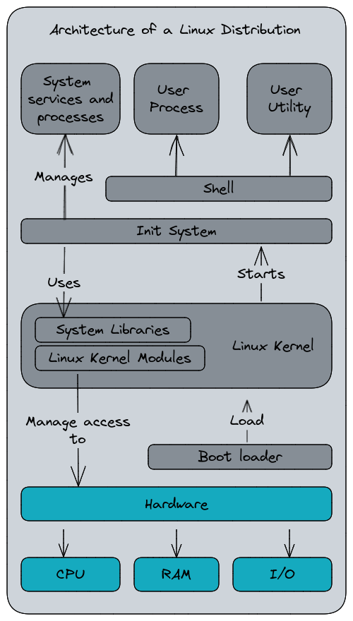
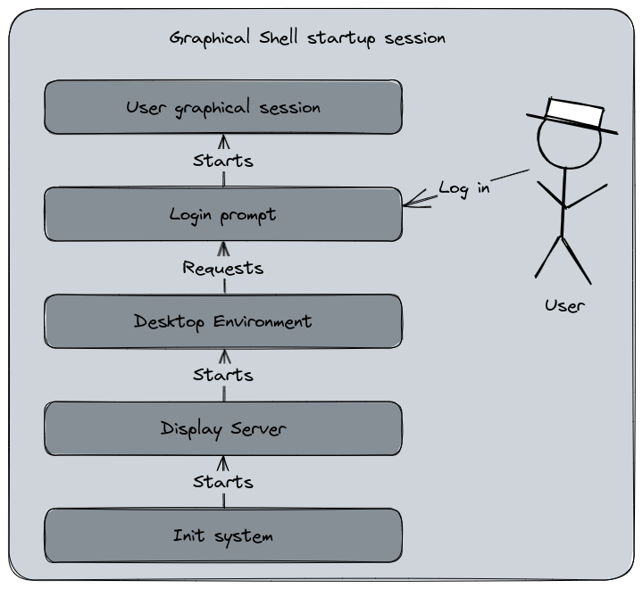

# Preface {epub:type=preface}

## About the author

I'm Seb and I’ve discovered Linux in the early 2000s, with a first attempt to install Debian Linux on my computer, but after printing kilometers of documentation and trying to have the display working, I’ve finally gave up. A few times later, I’ve found a Linux magazine with three Mandrake 9.1 CD-ROM. That was my actual first experience with Linux until I’ve started using Ubuntu Linux with its first release in 2004.

On a more professional side, I’ve started to see Linux for servers in my second job, mainly Red Hat Enterprise Linux. I had also some AIX system under my scope. Since I was using this system for my personal computer, I became more and more enthusiast with this system and after 20 years using it, I think I can write something about it. Today, I’m a solution architect working on the integration of CICD tools and process for business context and promoting the DevOps philosophy. 

## About this book

Linux Explained is addressed to beginners or newcomers to the Linux world. Additionally, if you also have some experience and want to develop your knowledge about what is Linux and its concepts, you’re welcome too ! This book will (try to) keep using simple words and explanation with the purpose of being the most accessible possible.

Linux Explained started as a series of articles I’ve wrote for my blog. Following this first publication, I had the idea to rewrite these articles to fit in a book. The original series is available at the following URL : https://blog.zedas.fr/tags/linux-explained/

The sources of this book (texts and diagrams) are available on GitHub and you are free to contribute to this work. This book is not set in stone and its content may evolve and improve with each contribution.

https://github.com/Wivik/linux-explained

# Copyright {epub:type=copyright-page}

Unless other statement, this book content, including the images, is licensed under Creative Commons BY-SA 4.0.


The cover page is illustrated with Tux, the Linux mascott, drawn by Larry Ewing and licensed under Creative Commons BY-SA.

# Chapter 1 : What is Linux ?

Usually, when we talk about Linux, we talk about a Linux Distribution. But actually, Linux itself is just one component of an operating system (ok, a very central one). Linux is a [kernel](https://en.wikipedia.org/wiki/Kernel_(operating_system)), a core computer program that manages the entire operating system. It's the interface between the hardware and the software : CPU access, Memory access, Filesystem access, devices access, all of this is made through the kernel. By misuse of langage, we assimilate Linux to an operating system but it's not exactly accurate because the OS is the integration of the Linux Kernel and various other softwares (we will detail this in the "What is a Linux Distribution" part).

This distinction is not specific to Linux, even in Microsoft's world you have it, but it's less confusing as the software is managed by a unique company unlike a Linux Distribution which integrates various projects together. Actually, Microsoft Windows 11 or 2022 are both operating systems based on the [Windows NT Kernel](https://en.wikipedia.org/wiki/Architecture_of_Windows_NT), the core program of Windows' architecture. In Apple's world, the kernel running behind every systems edited by the company is named [XNU](https://en.wikipedia.org/wiki/XNU). Since these two companies are providing a comprehensive product, these details are less advertised.

Linux is distributed under a free and open-source license, the General Public License 2.0, allowing anybody to use it, modify it, distribute it, and integrate it in other works. This is one of the many reasons that made the Linux kernel very popular for Servers systems, embedded systems, mobile devices ([Android](https://en.wikipedia.org/wiki/Android_(operating_system)) is based on Linux too), and even mainframes and supercomputers. If Linux was born for Intel x86 architecture at the beginning, the kernel now supports a multitude of platforms : ARM, PowerPC, etc.

## Unix and Linux history

In August 2021, Linux celebrated [its 30th birthday](https://blog.zedas.fr/posts/linux-a-30-ans/). In this article, in French (I can translate it later if requested), I've made a little history about the origins of the Linux Kernel. Linux is what we commonly call a "Unix-Like" or a "POSIX compatible" kernel. But, what are "Unix" and "POSIX" ?

Back in the mid-1960, the MIT, Bell Labs and General Electric were developing an operating system for a mainframe computer. This OS, named *[Multics](https://en.wikipedia.org/wiki/Multics)*, was innovative (with the idea of sharing the computer resources for multiple users, hierarchical filesystem, etc) but very difficult to develop and the project was eventually abandoned. The experimentation was reimplemented into a smaller scale project for a single-tasking system, *Unics*, later spelled *[Unix](https://en.wikipedia.org/wiki/Unix)* for reasons that seems to have been forgotten. The first version was released in 1970 after a development started in 1969, a date well known in the Information Technologies sector because it's what we call the [Unix epoch](https://en.wikipedia.org/wiki/Unix_time), a date and time representation using the number or seconds elapsed since the 1st January 1970 00:00:00 UTC. The Unix epoch timestamp is widely used in programmation to manipulate date and time. Also another very noticeable fact related to Unix is the creation of the [C programming language](https://en.wikipedia.org/wiki/C_(programming_language)) at the same moment. Unix itself has been rewritten in C with the release of its version 4 in 1973.

Unix has been later selected as the basis for a new operating system standard written in 1980 by the IEEE Computer society, the [Portable Operating System Interface](https://en.wikipedia.org/wiki/POSIX), or POSIX. POSIX is a standard describing both the system and user-level application programming interfaces (APIs) with command line shells and various utilities. The reason of this standard creation is mainly because Unix has been progressively copied, adapted and fragmented into various Unix-like systems developed by several companies that were often mutually-incompatible (HP-UX from HP, SunOS/Solaris from Sun Microsystems, AIX from IBM, etc).

Today, the Single Unix Specification is still evolving and the operating system based on the POSIX standard can be certified for using the commercial brand Unix. This is why Linux is described as a "Unix-like" system, because it was developed as a compatible POSIX kernel, but is not certified.

Linux itself is inspired by [Minix](https://en.wikipedia.org/wiki/Minix), another Unix-like system used by students. Created in August 1991 by Linus Torvalds, a 21 years old Finnish student, the source code of Linux has been submitted to the Minix mailing-list community. A couple of months later, the first "official" version of Linux able to run Bash, GCC, and some other GNU tools, was released. Despite its various limitations at this time, Linux has been adopted by numerous developers and later integrated by the GNU Project for its free and open source operating system, the GNU Operating System. The GNU Project was also developing its own kernel, GNU Hurd, since the mid-1980s.

In 1992, Linus adopts the GPLv2 license for the Linux source code and distributes it publicly, including the drivers code, in contrast of Unix which was mainly a proprietary system. Linux would eventually support the POSIX APIs and being able to run software and applications developed for Unix. The version 0.92 of Linux was able to run the X Window System, allowing to start graphic applications. The first suitable production version of Linux, tagged 1.0.0, has been released in 1994 containing 176 250 lines of code.

Nowadays, Linux is present in various embedded, servers, mainframes, supercomputers, mobile systems, and is powering a big part of the Cloud Computing.

## What is a Linux Distribution

As we said at the beginning, Linux itself is a kernel. Alone, its capabilities to interact with the user are limited because it needs other programs to perform tasks. In order to being useful, Linux needs a bundle of softwares and applications to use the computing resources distributed with it : that's the Linux Distribution.

A Linux Distribution (or Distro) is an operating system including a packaged Linux Kernel and a software collection. These packages are often maintained by a package manager, a tool that automates the installation, update, and removal of softwares packages from the system… Including the Kernel itself since it's new versions are also managed by the package manager.

Here is a simplified diagram about the architecture of a Linux Distribution with the relation with the components.



At the beginning, Linux was only distributed as source code to compile. Later, a set of two downloadable floppy disks was provided with one containing a bootable compiled Linux kernel, and a second with a set of the GNU utilities for setting up a filesystem. These floppy disks images are the very first Linux Distributions.

Today, the oldest still maintained Linux Distributions are [Slackware](https://en.wikipedia.org/wiki/Slackware) and [Debian](https://en.wikipedia.org/wiki/Debian). And don't imagine it took time to commercialize Linux, the first commercial distribution was Yggdrasil Linux/GNU/X released in December 1992 !

Yggdrasil Linux's full name is a good example about a [controversy](https://en.wikipedia.org/wiki/GNU/Linux_naming_controversy) running since ... A lot of time about how to name a Linux Distribution. Because Linux is usually distributed with a big part of the GNU tools developed by the Free Software Foundation's [GNU Project](https://en.wikipedia.org/wiki/GNU_Project), its founder Richard Stallman proposed the term "GNU/Linux" to describe a Linux operating system. It's a very old controversy because not everyone accepted the idea as it would create an unnecessary confusion for the user and "Linux" became *de facto* the common name for a Linux-based OS. And today it's still matter to debate. I won't go deeper in this topic, just remember that you can see this naming convention along with "Linux" and "Linux Distribution".

So, we have the basis, now let's drop some weird names you may had already seen : Slackware, Debian, Ubuntu, Red Hat Enterprise Linux, Fedora, Arch, Gentoo, etc, all of them are Linux Distributions. And Linux Distros, there are a lot of them ... I mean, [a freaking bazillions lot of them](https://upload.wikimedia.org/wikipedia/commons/b/b5/Linux_Distribution_Timeline_21_10_2021.svg).

To remain simple, a Linux Distribution is a software project that integrates the Linux Kernel, usually shipped with the GNU tool set (but there are some alternatives), a boot loader (optional too), and various software packages like a Window Manager for graphical Desktop environment, or other applications like a Web Browser or an office software suite (LibreOffice, etc).

They are a complete operating system defined by a philosophy and an architecture which are usually their own. These projects have often a specific goals or philosophies : being stable and reliable, providing only Free software packages (like Debian), being user-friendly (like Ubuntu or Manjaro), highly customizable targeting experimented users (like Arch or Gentoo), integrating cutting-edge technology (Fedora), security oriented (like Kali Linux), network oriented (like Pfsense), virtualization oriented (ProxMox), lightweight (Alpine Linux), etc.

# Chapter 2 : The bootloader, Init process and Shell

## The bootloader

The [bootloader](https://en.wikipedia.org/wiki/Bootloader) is a software that is responsible for booting the operating system of a computer. Booting the computer is the moment when you push the "Power On" button and have the hardware powered and initializing. Then the software starting up in order to be able to use the computing resources and eventually waiting for the user's inputs. The hardware starts a small program stored into a read-only memory chip attached to the motherboard, formerly known as the [BIOS](https://en.wikipedia.org/wiki/BIOS), and now replaced by the [UEFI](https://en.wikipedia.org/wiki/UEFI).

These programs provide basic interfaces to manage the lower layers of the hardware : I/O configuration, system clock, storage devices, boot management, enabling or disabled hardware features, etc. The UEFI is  more advanced than the traditional BIOS since it can provide a graphical user interface and a basic shell able to executes a limited set of commands.


A boot sequence is composed of two stages : the first one, the BIOS/UEFI is started and searches for bootable devices. And the second one : the bootloader launches the operating system, giving control to the computer to it.

In our case, we will talk about the bootloader described in the second stage.

A bootloader for Linux is a commonly provided and installed component (but can be optional in some cases), that manages a list of bootable partitions and allows the user to select which one they can start, and even modifying its starting parameters. A very common use case is when you install Linux on a computer that already hosts Microsoft Windows : this is what we call a dual boot. In this setup, the Linux bootloader starts at the second stage and proposes to start Linux or Windows. If the user chooses the second one, Windows' specific bootloader will be loaded and starts the NT Kernel.


[Picture licensed under GPL, source Wikipedia][1]


[Picture licensed under Public Domain, source Wikipedia][2]

One of the reasons because the bootloader may be optional is because the boot management can be directly performed by the system firmware, or because the UEFI can also handle it in some cases. 

One of the most popular Linux bootloader is [GNU GRUB](https://en.wikipedia.org/wiki/GNU_GRUB). This program is installed during the Linux distro's initial setup and manages how the Linux Kernel is loaded to memory. GRUB maintains a list of bootable partitions and presents a menu at boot time, with a specific timeout. If the countdown is finished, the default partition will be started.

In our previous example, the most common use case is to manage a dual boot with Linux and Windows. But GRUB can also manage several Linux Kernel versions to select for startup. For example, when you have a new Kernel installed by the system updates, GRUB keeps the boot sequence entry for the previous Kernel version in case of any trouble with the new one. Additionally, you can edit in the boot arguments passed to the Kernel directly from the GRUB menu.

For example, you can blacklist a Kernel Module to ensure it won't start. And of course, you can have several different Linux Distributions installed on your system, GRUB will manage them too.

Please note that it's not actually GRUB that manages itself the boot list of the previous Kernels, but rather a post-installation step of the kernel package that updates GRUB's list of partitions.

[1]: https://en.wikipedia.org/wiki/Bootloader#/media/File:Debian_Unstable_GRUB2_(2015).png
[2]: https://en.wikipedia.org/wiki/Bootloader#/media/File:Windows_Boot_Manager_with_Windows_7,Vista_and_XP.png

## The Init Process

Remember our previous article and the Linux architecture diagram ? Now we will explain what is the Init System, or Init Process, that starts after the Linux Kernel startup.


Init, short for *Initialization*, is for Unix-based Operating Systems the first process started during the boot sequence, after the Kernel startup. It is recognizable by it's Process ID (PID) Number : 1. 


After the Linux Kernel has started, set up the system, and mounted the root file system, the init process is started. The Init process is a daemon, a background service, that will read its configuration files and starts the various other daemons that compose the operating system. If the Kernel is unable to start the Init daemon, it will result a Kernel Panic : a fatal error halting the system.

The Init process will determine, according to its configurations files, the runlevel. The [runlevel](https://en.wikipedia.org/wiki/Runlevel) is a mode of operation for an Unix-based system using the System V-style init method. It is a number, starting from 0 to 6, that defines the expected state of the system when entering at this runlevel.

There are three standards runlevels :

0. Turns off the device
1. Single user mode, the system starts without network interfaces or daemons
6. Reboots the device

The Linux Standard Base Specification defines the following six runlevels :

0. Turns off the device
1. Single-user mode, for administrative tasks
2. Multi-user mode, does not configure network interfaces and does not expert networks services
3. Multi-user mode with networking, starts the system normally
4. Not used/user-definable
5. Full mode, usually when the Display Manager and the Desktop Environment are started
6. Reboots the device

The Runlevels affectations can vary between the Linux Distros.

Basically, the Init daemon will starts the runlevel 3, 4 or 5 which are the most common for a normal usage. The runlevel 2 is preferred for emergency, recovery, or administratives tasks that wouldn't require network (ex : fixing a filesystem error). In the Init system configuration files, the daemons are affected to a runlevel that determine the moment for their startup during the boot sequence.

In this article, I've quoted two init daemons : System V and systemd (sic). System V is the main init daemon made for Unix systems. Linux used an init system that was compatible with System V, often referred as SysV, but other distributions were, or are, using other [init services](https://en.wikipedia.org/wiki/Init#Other_implementations). Nowadays, systemd has been adopted by most of the major Linux distributions, not without [critics](https://en.wikipedia.org/wiki/Systemd#Reception).

One main difference that systemd has is the replacement of the startup scripts and the runlevels by configuration files describing the daemons and when do they should start. It uses a parallel startup sequences that is expected to reduce the boot time. systemd uses a notion of targets to attain, inspired by the runlevel, but in a more semantic way. The targets are "multi-user", "graphical", "user-session", which mostly corresponds to runlevel 3 for the first one and 5 for the two others in the former init system's definition.

To ensure a certain compatibility for pre-systemd scripts, the historic command `init` became symbolic link to the `systemd` binary. And the `service` command (that managed the daemons start and stop) forwards to the `systemctl` management tool. This setup may vary according to how the Linux Distribution project integrates systemd.

```bash
$ file /usr/sbin/init
/usr/sbin/init: symbolic link to ../lib/systemd/systemd
```

Here is the definition of the CUPS service (the printing daemon) with systemd's configuration format. You may observe the notion of dependencies and orchestration with the `After` or `WantedBy` keywords. In this example, CUPS is started when the system is reaching the `multi-user` target.

```toml
[Unit]
Description=CUPS Scheduler
Documentation=man:cupsd(8)
After=network.target nss-user-lookup.target nslcd.service
Requires=cups.socket

[Service]
ExecStart=/usr/sbin/cupsd -l
Type=notify
Restart=on-failure


[Install]
Also=cups.socket cups.path
WantedBy=printer.target multi-user.target
```

Additionally, systemd became more a system management tools suite than an init daemon in the strict way. It provides a set of features to manage a centralized journal logging, device management, network, etc. This is one of the criticisms the community made against systemd, despite the various enhancement it provided, because of its complex design and its tendency to integrate too many system components into one service.

Arrived here, you may have noticed that there are always criticisms or controversies at various stage of a Linux distribution composition... That's the usual communities drama. It can be seen as a problem by some people, but for me it's also the fuel for the diversity in the offer the community provides because it drives the various forks and derivative works. And if everybody was always agreeing, it would be boring ! 😅 

End of parenthesis, now let's take a look to the next component, the Shell.

## The Shell

The [shell](https://en.wikipedia.org/wiki/Shell_(computing)) is a computer program that provides the interface between humans, or other programs, with the operating system. It can be a text shell, a command line interface, or a graphical shell, the Desktop Environment. Text-based Shell are working with the input of commands into a text console and returns a result meanwhile a graphical shell interacts with the user by manipulating visual objects such as windows, buttons and menus.


Once the init system has finished loading the various daemons and processes, it starts the login prompt. The user is now required to authenticate with the system in order to continue. After the user has input their username and password, the shell profile is loaded from the system-wide settings, and then, the specific user's settings. Once the profile is initiated, the shell switches to interactive mode and waits for user's inputs. The shell processes the commands typed by the user and returns their results.


*An example of commands passed to a shell session. In this session, I've moved to the `/tmp` folder and asked to display in which folder I'm currently working in (command `pwd`).*

The shell profile is a set of files installed at different places in the system. There are at the system's configuration files level (a directory name `/etc`), and in the user's home directory (usually `/home/{username}`). The directories and filesystems will be explained in the next article, I won't go into these details now.

### The text console shell

Usually, a server-oriented Linux distribution will not have a graphical user interface, only a command-line shell. This interface uses a scripting language composed of commands with arguments in order to perform tasks. There are several different shells : the Bourne Shell (sh, one of the most historic one), the Bourne-Again Shell or bash (one of the most common, part of the GNU Project), the Z shell or [zsh](/posts/zsh/) (a modern bash-compatible shell), etc. The command line interface can be used to manipulate files and folders, perform administrative tasks like creating and updating users, launching programs, managing the system, etc.

As the shell is a complete scripting language able to use conditions, return codes, functions, and various other features. It can be used to develop several automated procedures usually called "shell scripts", some can be very advanced. The interest to use this scripting language is, of course, to automatize various tasks on the system. In a shell script can do a lot of awesome and complexe things, but writing too complex shell programs is not what I would recommend. I would recommend to rely on a language like Python if you want to create complexe tasks.

The shell profile we talked about earlier is itself a set of shell scripts. For example, a bash-based shell will use the `~/.bash_rc` or `~/.bash_profile` file to load the user's specific profile. These file can contains aliases, functions, environment variables, etc.


For example, you may know [I like the](https://fortune.zedas.fr) `fortune` command and `cowsay`... So basically, my shell is displaying it at each opening. My file `~/.zshrc` (because I use zsh and not bash) contains this line : 

```bash
fortune | cowsay
```

A little word about the notation shown above, the piped notation. It's a way to combine the commands inputs and outputs into a pipeline. Another word about the `~` notation, it's a shortcut for the `/home/{user}` folder, we will explain this in the filesystem part.

Actually, the shell uses a notion of Standard streams. I won't detail them too much, there will be in a dedicated part for that, but in a nutshell there are three communications channels the shell can use :
- Standard input (stdin) for user inputs
- Standard output (stdout) for commands outputs
- Standard error (stderr) for errors or diagnostic messages

Thanks to redirections functions, the user can interact and use the three of them at various degrees such as manipulating the output of a command, input a command's content from the standard input instead of reading a file, etc. We will see that in a dedicated article.

### The Graphical shell

As we said above, a shell can also be a graphical session. For Linux, you may have heard about the notion of Window Manager, or Desktop Environment. [GNOME](https://www.gnome.org), [KDE](https://kde.org), [Cinnamon](https://projects.linuxmint.com/cinnamon/), [Xfce](https://xfce.org), the choice is vast. These Desktop Environments have all their own user experience and goals (user friendly, lightweight..) and a Linux distribution shipped with a default Desktop Environment can easily switch to another one without changing the operating system.



A graphical shell is composed of three elements : 
- A Display Server
- A Window Manager
- A Desktop Environment

A Display Server is a part of the graphical system for a Linux distribution. The Display Server is the bridge between the Desktop environment and the Linux Kernel. It can uses network capabilities to display a software that is actually running on a remote server. The historic Display Server on Linux is the revered [X11](https://en.wikipedia.org/wiki/X_Window_System), or X Window System (protip : ensure you don't write "X Windows System", you may have people grind some teeth), created in 1984 to provide a framework for a GUI environment for Unix systems. Another Display Server for Linux and Unix-like systems is [Wayland](https://en.wikipedia.org/wiki/Wayland_(protocol)), far more younger, it aims to replace X11 with modern and simpler base.

The Window Manager is the programs that runs on top of the Display Server. It provides the look and feel of the graphical interface. This component is responsible for the windows and buttons arrangement, decorations, handling the user interactions, etc.

The Desktop Environment is built on top of both Display Server and Window Manager. It's a complete suite of applications that provides a consistent user experience. The most well known are GNOME and KDE Plasma, with also Xfce which is older. Like the Linux Distributions themselves, the Desktop Environments are developed and maintained by communities with a purpose and a philosophy on their own.

One thing I like a lot with the Linux Desktop Environments is that you're not locked by the one the Linux Distribution integrates. Personally, I don't really like KDE's layout and GNOME has lost me following its changes in the version 3. However, there are alternatives than can be installed and usually switched to with a little adaptation (the integration may not be perfect and some configuration adjustments could be required) and you can still use your favorite Linux distribution with your favorite Desktop Environment. In my case, I like Cinnamon.

Of course, having a graphical shell does not prevent to use a text console shell. The Desktop Environment provides a terminal emulator that allows to work in command line. My favorite is [Terminator](https://terminator-gtk3.readthedocs.io/en/latest/). Also, the system can be configured to disable the graphical shell and running it on-demand to preserve resources.

# Chapter 3 : The Filesystems

## What is a filesystem ?

A [filesystem](https://en.wikipedia.org/wiki/File_system), or FS, is the method an operating system uses to structure the data on a storage device (hard drive, SSD, USB flash stick, whatever). It's a logical view of the physical storage that describes how the disk is organized and how and where the various data pieces are stored and identified to compose a consistent file. Indeed, when a file is written on disk, the content is actually cut into several parts written in blocks. Your file is like a series of books stored on a shelf. In this metaphor, the shelf would be the file and the books its fragments. The blocks size may vary according to the filesystem format settings.

In a more simple words, the filesystem is the mapping chart of the physical storage for the operating system. Here is a very simple diagram to explain this :


Ever heard about "formatting a disk" ? For the end-user, this action usually means "erasing the content". Actually that's a side effect because the formatting process will commonly rewrite the file allocation table, delete the files metadata, and throw back the related sectors into the "free sectors pool". In a nutshell, the disk "forgets" its contents. But the data pieces on the disk may still remain until they are overwritten by new ones. This is how the recovery tools work when you try to recover a file you've erased by mistake : they usually inspect the sectors for orphaned data pieces and try to reconstruct the file.

There are various filesystems type existing. This diversity is mostly related to the diversity of storage types : optical, tapes, database filesystems, network filesystem, etc. One very well known is the [FAT](https://en.wikipedia.org/wiki/File_Allocation_Table) - File Allocation Table -, created in 1977 for floppy disks and adapted for hard drives, it was also the MS-DOS default filesystem, also for Microsoft Windows, until [NTFS](https://en.wikipedia.org/wiki/NTFS) replaced it. One of the biggest advantage for the FAT filesystem (mostly in this exFAT and FAT32 version) is that it became a *de facto* standard and is used in almost every device that uses external storage. For instance, my camera formats its memory cards in exFAT. Despite being patented by Microsoft, the exFAT and FAT specifications has finally been publicly released by the company in 2019.

On Linux, the most common filesystems type today are [ext4](https://en.wikipedia.org/wiki/Ext4) (preceded by ext2 and ext3), [xfs](https://en.wikipedia.org/wiki/XFS) or [btrfs](https://en.wikipedia.org/wiki/Btrfs). Each of them has its specificity and purpose :
- ext4 is pretty common for Linux. It's the successor or ext3 which was very popular
- xfs targets high performance and large storage arrays but it can be used without this specific purpose
- Btrfs is more recent and supports advanced features like snapshots, subvolumes, and online defragmentation. Btrfs is the default filesystem for Fedora Linux since a couple of releases (Fedora 33).
- FAT32, exFAT, and Microsoft's NTFS are also supported by Linux
- [Tmpfs](https://en.wikipedia.org/wiki/Tmpfs) is also a filesystem now common on Linux to replace the physical storage of the /tmp partition with a virtual partition in the system's RAM, typically to avoid unnecessary writings for flash-based storage devices like the SSD that would reduce their lifespan.
    - The same idea exists for the Swap partition
- For network file systems, you will usually hear about [NFS](https://en.wikipedia.org/wiki/Network_File_System_(protocol)) and [SMB](https://en.wikipedia.org/wiki/Server_Message_Block) protocols that can mount a remote storage through the network layers.

ext4, xfs and Btrfs have all a common thing : they're journaling filesystems (NTFS too, but it's a Windows native FS, not Linux). In a nutshell, a journaling filesystem keeps tracks of the changes not yet committed into a "journal", a circular log file. In case of a failure event (power failure, system crash, etc), these filesystems can be brought online faster and are more resilient to the risk of corruption. Basically, the journal stores the write events before actually executing them on the disk, preventing the risk of orphaned data blocks or storage leak, meaning the free sectors are not released into the pool for being reused. The journaling filesystem has been created by IBM with AIX 3.1's JFS in 1990. Microsoft implemented it in its Windows NT's NTFS in 1993. For Linux, the journaling FS arrived in 2001 with ReiserFS and ext3.

## The filesystem structure and mount concept

Linux's filesystem organization is standardized in the [Filesystem Hierarchy Standard](https://en.wikipedia.org/wiki/Filesystem_Hierarchy_Standard) specification. Inherited from the [Unix Filesystem](https://en.wikipedia.org/wiki/Unix_filesystem), the structure is very similar. On Microsoft Windows, a filesystem is represented by a letter, usually the `C:` drive for the main one, and `D:` for the next one, which may be an optical drive, etc. On Unix and Linux, this notion does not exists. 

### The Filesystem hierarchy

On Linux, the primary hierarchy level is the *root*, represented by the `/` character. There is no logical separation like Windows do with its letters. On Linux, the various filesystems present in the partition table are mounted in subsequent levels of the root folder. All files and folders are stored after the root level, even if they are physically on another device.

Here is the content of my root folder, `/`, displayed by the command `tree` :

```bash
$ tree -d -L 1 /
/.
├── afs
├── bin -> usr/bin
├── boot
├── dev
├── etc
├── home
├── lib -> usr/lib
├── lib64 -> usr/lib64
├── lost+found
├── media
├── misc
├── mnt
├── net
├── opt
├── proc
├── root
├── run
├── sbin -> usr/sbin
├── snap -> /var/lib/snapd/snap
├── srv
├── sys
├── tmp
├── usr
└── var

```

Let's explain some of these folders :

| Directory | Description                                                                                                                                                                                                                                                                                                                                                                                                                            |
|-----------|-------------------------------------------------------------------------------------------------------------------------------------------------------------------------------------------------------------------------------------------------------------------------------------------------------------------------------------------------------------------------------------------------------------------------------------------|
| `/`       | The first level of the folder hierarchy. Everything is under it.                                                                                                                                                                                                                                                                                                                                                                          |
| `/bin`    | This folder contains the essential binaries, or executable programs, required for the single-user mode, the mode without the network layers enabled commonly used for administrative and recovery tasks (We've seen that in the Part 2's Runlevels sections)                                                                                                                                                                                            |
| `/boot`   | This is the place where the bootloader is installed.                                                                                                                                                                                                                                                                                                                                                                                      |
| `/dev`    | This folder contains the devices files, a description of the physical devices on the system, and also logical ones. For example, you can invoke `/dev/random` to display a random number, or redirect something to `/dev/null` to discard it immediately. Also your storage is represented in a way such as `/dev/sda1`, etc.                                                                                                             |
| `/etc`    | This folder contains the host-specific configurations files. Here, you may find for example the `/etc/hosts` file that associates an IP address to a host name, or `/etc/fedora-release` (adapt it to any distro) that contains the release version of your distribution, or `/etc/hostname` that contains the computer's name.                                                                                                                                                                 |
| `/home`   | This is the home folder of the users of the system. Unless other statement during the creation, a user will always have its personal files stored into a subfolder named after the username in this directory. (ex : `/home/seb`). A shortcut to this folder exists : the character `~`. Typing `cd ~` is equivalent to typing `cd /home/seb` for example. Additionally, invoking `cd` without args will also redirect to the home folder. |
| `/lib`    | Contains the essential libraries for the binaries. Libraries are specific components included during the coding of a binary to provide a specific feature, a collection of functions, dataset definitions, etc. For example, the `openssl` lib will provide the TLS encryption functions that can be used by a program or `libyaml` will provide the functions for YAML data structure manipulation.                                                                                                |
| `/media`  | This folder is a mount point for the removable medias like CD-ROM and USB flash storage. A directory in`/run` can also be used for temporary filesystems mount points.                                                                                                                                                                                                                                                                                                                                                          |
| `/mnt`    | This folder is also for mount points, for temporary ones too.                                                                                                                                                                                                                                                                                                                                                                                 |
| `/opt`    | This folder usually stores the application software packages, which are not especially shipped with the distribution by default.                                                                                                                                                                                                                                                                                                          |
| `/proc`   | This virtual filesystem stores the process and kernel informations files. You may find there files named after the Process ID of a running program and various informations inside the kernel uses too.                                                                                                                                                                                                                                   |
| `/root`   | The only by-design exception of the `/home`, `/root` is the `root` user home folder. We never talked about the `root` user : it's the super admin of a Linux system. We will address this point in the article dedicated to the users management.                                                                                                                                                                                         |
| `/run`    | A folder containing run-time data like variables, currently logged-in users, running daemons...                                                                                                                                                                                                                                                                                                                                           |
| `/sbin`   | The essential system binaries for the single-user mode. It's like the `/bin`, but the commands available there are only addressed to power users or the system admin (root).                                                                                                                                                                                                                                                              |
| `/srv`    | A folder reserved for server data, like a web server or FTP.                                                                                                                                                                                                                                                                                                                                                                              |
| `/tmp`    | A folder, which is now a filesystem stored in RAM, used for temporary files. It's oftenly not-preserved on reboot, you may only store here disposable files.                                                                                                                                                                                                                                                                              |
| `/usr`    | A secondary hierarchy structure that reproduces the `/` structure. It contains the majority of the multi-users commands, utilities and applications. If you look back at the directories lists I've displayed above, you may notice that `/bin` and that `/sbin` are directing to `/usr/bin` and `/usr/sbin`. It's usage and integration may vary across the Linux distrubtions.                                                          |
| `/var`    | Variable files, may content caches, logs, locks files, etc. It can be seen like the `/tmp` as a non-critical file storage, but this one is preserved are reboot.                                                                                                                                                                                                                                                                          |


## What is mounting a filesystem ?

So far, we have seen that a filesystem is how the storage is seen and sorted by an operating system, and how it structures it. But in order to be exploited, a filesystem needs to be mounted. Mounting a filesystem is associating a storage device's partition to a path the system will be able to access and use the data stored on it.

The physical device has a partition table described how its content is organized : which type of filesystem, if it's a bootable filesystem, etc. When you plug an USB flash drive to your computer, the Kernel will detects a new device. The device is detected as a file storage and the related driver takes it in charge. Then, the Kernel associates the filesystem present on the removable drive to a mount point (usually `/mnt/the-partition-name` or `/run/media/user/partition-name`). 

For example, when I insert my camera SD Card, the system will mount it like this :

```bash
/dev/sdc1 on /run/media/seb/NIKON Z 5 type exfat 
```

- `/dev/sdc1` is the device's partition file my system attributed to the SD Card
- `/run/media/seb/NIKON Z 5` is the folder on my system from where I can access to the SD Card's content
- The `type` field indicates which filesystem is used. In this case : exFAT.


To compare with the Windows world, my SD Card would have been mounted with a `D:\` letter. In the Linux world, the SD Card is mounted in `/run/media/seb/NIKON Z 5`, a directory path. Why ? Because as we said above, in the Unix filesystem, each file and folder is below the root top level hierarchy.

Another example. My computer has two drives : one for the system, one for the data. If I go in `/media` and I use the command `df .` to display the remaining storage capacity of the current path, I'll see I'm on the root filesystem.

```bash
$ cd /media
$ df . 
Filesystem               1K-blocks    Used   Available Use% Mounted on
/dev/mapper/fedora-root  71670904 58155208   9829296   86%  /
```

Now, I move to the `data/` folder which is actually the mountpoint of my secondary drive. The filesystem has changed, the amount of storage also (yes, I will do some cleanup one day).

```bash
$ cd /media/data
$ df .
Filesystem     1K-blocks      Used Available Use% Mounted on
/dev/sda       960303848 885484368  25964968  98% /media/data
```

If I do the same for my NAS, a storage available from my network, mounted on `/media/nas` : 

```bash
$ cd /media/nas
$ df . 
Filesystem                1K-blocks       Used      Available Use% Mounted on
192.168.1.101:/nas    5814086144 4873881088 647169024  89% /media/nas
```

Let's go a little further with the filesystem mountpoint concept. Usually, the root filesystem contains `/boot`, `/etc`, `/bin`, etc. But, let's admit I have a 250GB disk for the system, and I want to use a 1TB disk for the `/home`. That's not a problem, the root filesystem could be installed on the 250GB disk, and the `/home` folder will be mounted from the partition on the 1TB disk. That's a common setup to preserve the content of the `/home` directory in case of a system reinstallation : you can avoid formatting the filesystem hosting the `/home` data in the process.

When we seen the startup sequence of a Linux-based operating system, one step was "Mounting the filesystems". Linux don't guess it miraculously, they're defined into a system file : `/etc/fstab`. This file contains the name of the physical partition, the mountpoint, and the options to apply to each of the entries defined here. Mount the filesystems during a Linux boot sequence means : mounting the `/etc/fstab` content.

Example of a fstab file content :


```bash
/dev/mapper/fedora-root /                       ext4    defaults        1 1
UUID=0feb407e-cc33-4718-98b7-f9e7362968c3 /boot                   ext4    defaults        1 2
```

Each filesystem defined in `/etc/fstab` can be quickly mounter by the `mount` command.

For example, if I have the following line in `/etc/fstab` : 

```bash
/dev/sdc1 /media/somefilesystem ext4 defaults 1 1
```

Using `mount /media/somefilesystem` will mount it according to this entry defined in `/etc/fstab`. There is also the [autofs](https://www.kernel.org/doc/html/latest/filesystems/autofs.html) module that is able to automatically mount a filesystem defined in another set of configuration files when going into its mountpoint path.

On Linux servers, we usually use the [Logical Volume Management](https://en.wikipedia.org/wiki/Logical_volume_management) which is an flexible abstractive filesystem that present a consistent storage volume composed of several physical disks. It's main asset is that you can extend the filesystem capacity by adding physical disks to the array and allocating the capacity to the filesystem, it's very used in virtualization (in this case, the disks are virtual). On a Server's filesystem, the `/var`, `/opt` and `/srv` would be mounted from LVM filesystems than can be extended it the storage capacity gets too small during the ramp-up of a service for example.

# Chapter 4 : The file permissions

Now we have seen how do Linux organizes its filesystem, let's see how it manages the permissions of the files and folders.

It won't be a surprise, Linux's file permissions are also inherited from Unix. The file permissions are one of the core features of Linux's security model : determine who can access to what and what they can do on it. Of course, and the security parenthesis later will confirm that, the file permissions are just a component among several other ways to secure a Linux installation.

## How to see the file permissions

Let's list my `/etc` folder content. This time, I use the `ls -l` command that will display the files metadata.

```bash
drwxr-xr-x.  3 root        root         4096 Mar 10  2022 abrt
-rw-r--r--.  1 root        root           16 Feb  4  2020 adjtime
```
In this result, I have to types of files : a directory, and a file. How can I see the difference ? Here is how to read this output.

For the `adjtime` file, we have the following elements that interest us in this particular case :

- `-rw-r--r–.` : This attribute can be split into :
    - `-` : The file type. In this case, it's a regular file.
    - `rw-r--r-` : The permissions settings
    - `.` : The extended attributes
- `root` : the user owning the file
- `root` : the group owning the file

For the `abrt` file, you may had noticed a difference with the first character : `d`. That means it's a directory. You may also noticed that the permissions are different.

Remember : for Unix, everything's a file ! No matter if its a directory or a text file or a hard drive or an executable program.


## How to read the file permissions

In our previous example, we had two different set of permissions for a file : `rwxr-xr-x` and `rw-r--r--`. These strings are actually composed of three blocks : 

- For the `abrt` directory :
    - `rwx`
    - `r-x`
    - `r-x`
- For the `adjtime` file :
    - `rw-`
    - `r--`
    - `r--`

These three blocks stand for, in this order :

- The permissions for the user owning the file (**owner**)
- The permissions for the group owning the file (**group**)
- The permissions for the other users (which are different of the owner, and not in the group - **others**)

Now, we have letters, what do they mean ?

- `r` : Read
- `w` : Write
- `x` : Execute

If the letter is present, the permission is granted for the related set of permissions (owner/group/others). If not, the permission is replaced by the `-` symbol.

When a user requests an access to a file, the system will check in the following order if the permissions allow it :

1. Check if the user is the owner of the file. If so, no other checks will be made.
2. If you're not the owner of the file, the system will check if you're a member of the group owning the file. If that's the case, you will have access to it according to the group's permissions
3. If you're neither the owner or belonging to the group, the system will use the others permissions.

The three permissions sets are mutually exclusive.

The permissions grant a specific access the file :

- Read (`r`) will authorize the file's content access. Tools like `cat`, `less` or `vim` are able to open it and display it's content. However, it's impossible to modify its name or its content. Read permission is also required to be able to copy a file. For a directory, this permission allows the usage of the `ls` command and its counterparts to display the content.
- Write (`w`) will authorize to rename or modify the file's content. If this attribute is set to a directory, it means the user can create, modify, or delete a file present inside this directory. Write is also required in order to be able to use the shell's redirection operations (`>` or `>>`) to a file.
- Execute (`x`) will authorize the execution of the content of the file like a program. Each executable binary in the system has this permission. Also, this permission is required in order to be able to navigate into a folder with the `cd` command.
    - Please note that the execute permission is not mandatory for scripts such as Bash or Python scripts, because you can run them by using their interpreter which is an executable file itself : `bash script.sh` or `python script.py`.

Let's show an example, I've wrote a file name `file`.

```bash
$ ls -l file
-rw-r--r--. 1 seb  seb     6 Feb  8 22:41 file
# my user and group are owner, and the others can read.
$ echo something >> file
$ ls -l file
-rw-r--r--. 1 seb  seb    16 Feb  8 22:42 file
# The content size changed.
# I've changed the owner, now it's root.
$ ls -l file
-rw-r--r--. 1 root root   16 Feb  8 22:42 file
$ echo somethingelse >> file
zsh: permission denied: file
# I can't write anymore in this file.
$ cat file
pouet
something
# but I can still read it
# I remove the Read access to Others
$ ls -l file
-rw-r-----. 1 root root   16 Feb  8 22:42 file
# Let's try to read it
$ cat file
cat: file: Permission denied
# :(
```

## A security parenthesis

A little note about Linux's security. A common mistake is usually to believe that removing the Execute attribute to a file will protect the system from uncontrolled script executions. But like we said, using the interpreter executable command will make this idea irrelevant for an interpreted programmation language such as the shell, Python, Perl or Java. If you want to prevent the execution of commands and script from a specific filesystem (typically : the home users directory), you need to apply a specific flag to the mountpoint : `noexec`. Of course, it's just one possibility among a lot of other one in order to secure a Linux installation.

Another common mistake is to believe that thanks to its file permissions system, Linux is "more secure" than Windows, but that's terribly wrong. Linux is today [as much targeted by malwares](/posts/linux-and-the-malwares/) as Windows, but the attack patterns are different. So this reminder seems important to me :

**A Linux Distribution is not more or less secured by design than any other operating system, and especially not out of box. Securing and hardening a Linux installation is a specific work requiring advanced competences in matter of system administration and IT security. And more important : Linux is not foolproof !**

Additionally, I'll complete with another very despicable practice I can still see today… Applying the full permissions access to a file. If you read any tutorial or advice telling you "use `chmod 777 file`", don't do that unless you fully understand, and have challenged, this requirement. In other cases, that's a terrible practice. It's basically giving an open bar access to the content without any control over it.

## The octal values for permissions

The example about the bad practice is a nice transition to a second way to read (and specify) your filesystem's permissions : the octal value. Instead of using the letters notation (r, w, x), you use numbers : respectively 4, 2, 1. 

- Read : `r` = `4`
- Write : `w` = `2`
- Execute : `x` = `1`

In the bad example I've exposed just above, I've used the command `chmod`. This command changes the permissions of a file, and in this case, I've used the octal notation. `777` = `rwxrwxrwx` here. The three numbers represent the Owner, Group, and Others just like the three `rwx` groups.

If we recall our first examples with the `adjtime` file and `abrt` folder, here is the correspondance of their permissions :

- `abrt` folder : 
    - Letters notation : `rwxr-xr-x`
    - Octal notation : `755`
- `adjtime` file :
    - Letters notation : `rw-r--r--`
    - Octal notation : `644`

Each permission set is the addition of the three octal values :

- `rwx` = 4 + 2 + 1 = 7
- `rw-` = 4 + 2 + 0 = 6
- `r-x` = 4 + 0 + 1 = 5
- `r--` = 4 + 0 + 0 = 4
- `---` = 0 + 0 + 0 = 0

So, if I use a concrete application of the command `chmod` :

- Give full permissions to Owner, Read to Group, Nothing to Others : 
    - Octal notation : `chmod 740 file`
    - Letters notation :
        - `chmod u+rwx file`
        - `chmod g+r-w file`
        - `chmod o-rwx file`

And that's why I prefer the octal notation, it's easier to apply. Once applied, we have the following result :

```bash
$ ls file
-rwxr-----. 1 seb  seb    16 Feb  8 22:42 file
# Want to display the octal notation ? use the 'stat' command
# And check "Access"
$ stat file
  File: file
  Size: 16        	Blocks: 8          IO Block: 4096   regular file
Device: 0,33	Inode: 2013        Links: 1
Access: (0740/-rwxr-----)  Uid: ( 1000/     seb)   Gid: ( 1000/     seb)

# I'm curious, what is the Access on a folder ?
$ stat snap-private-tmp
  File: snap-private-tmp
  Size: 40        	Blocks: 0          IO Block: 4096   directory
Device: 0,33	Inode: 2           Links: 2
Access: (0700/drwx------)  Uid: (    0/    root)   Gid: (    0/    root)
```

If you read these two `stat` output you may want to recall the `d` letter before the permission suggesting a folder. For `snap-private-tmp` yes, we have it : `drwx------`. This folder has very restrictive accesses : only `root` can read, write and access to its content, nobody else.

But if you read carefully both of these outputs you may possibly ask : 

> Hey, why is there a `0` before `740` and `700` ? Is that the octal value for the directories ?

Nope, that's something else :

## The special file permissions

Actually, the octal notation is on 4 numbers, not 3. The first digit is here to apply the special file permission. These special permissions grant additional privileges to the files and directories :

- SUID (Set User ID) : this special permission is set for the Owner access level. If the file is executable, it will always be executed as the user owning the file, regardless of the current user passing the command.
- SGID (Set Group ID) : this special permission has two possibilities :
    - If set on a regular file, the result will be the same as the SGID. The execution of the file will have the same permissions as the Group's permission applied on it.
    - If set on a directory, any files created in it that have the same group's ownership as the directory owning them

A very good example of the SUID usage is the `sudo` command. `sudo` is an administrative tool that permit an authorized user to impersonate another identity on the system. To be able to work, the command uses the SUID and is owned by `root`. Since `root` can switch to any other user with no password prompt, this command will temporary grants a `root` permission to the user invoking it.

```bash
$ stat /usr/bin/sudo                                                                                           
  File: /usr/bin/sudo
  Size: 202328    	Blocks: 400        IO Block: 4096   regular file
Device: 253,0	Inode: 2497570     Links: 1
Access: (4111/---s--x--x)  Uid: (    0/    root)   Gid: (    0/    root)

```

`sudo` has very interesting permissions : `411`

- The owner cannot read the file's content
- The group owner cannot read it tool
- ... Neither the others

But these permissions grant the possibility to execute the command for anybody. And because of the presence of the SUID flag (`4`), the command will always be executed with `root`'s permissions.

Example :

```bash
# Using the whoami command, that displays
# the current user's name
$ whoami
seb
# by default sudo switches to root
$ sudo whoami
root
# but you can specify a username
$ sudo -u apache whoami
apache
# that's the magic of the SUID
```

I'm sure you have a question here :

> Mmmh how can the file permissions secure Linux if a command can allow anybody to become super admin ?!

Good question : `sudo` is not a dumb command. It relies on a list of allowed users with the commands they can perform as another one, the `sudoers`. So if the current user is not in the `sudoers`, `sudo` will reject the input and [report the incident](https://xkcd.com/838/).

Now let's make an example for the SGID, which ensure the files created in a directory will always have the directory's permissions whoever is writing them.

```bash
# I have created two directories
# One "sgid" owned by me and the "root" group, with the SGID
# One "nosgid" owned by me and the "root" group, with no SGID
# The Others has no permissions
$ ls -l
drwxrws---. 2 seb  root   60 Feb  9 23:01  sgid
drwxrwx---. 2 seb  root   40 Feb  9 23:01  nosgid
# I create a file in the nosgid folder using the "touch" command
$ touch nosgid/test
$ ls -l nosgid/test
-rw-r--r--. 1 seb seb 0 Feb  9 23:04 nosgid/test
# Me and my group are owner
# Now let's try in the sgid folder
$ touch sgid/test
$ ls -l sgid/test
-rw-r--r--. 1 seb root 0 Feb  9 23:06 sgid/test
# The group owning the file is root's, not mine
```

The special permissions have both the letter and octal notation, just like the regular one.

- No special permission : `-` = `0` (`0` in `0755`)
- SUID : `s` (at owner level) = `4` (`4` in `4111`)
- SGID : `s` (at group level) = `2` (`2` in `2770`)
- Sticky : `t` (at others level) = `1` (`1` in `1755`)

We will explain Sticky in the next step.

The permissions I've used in the example above have been set like this :

- Letters notation :
    - `chmod u+rwx sgid`
    - `chmod g+rws sgid`
    - `chmod o-rwx sgid`
- Octal notation :
    - `chmod 2770 sgid`

### Another special permission, the Sticky Bit

The Sticky bit is set at the Others level and is different than the two previous special ones because it doesn't affect the files themselves. Set at the directory level, the sticky bit restricts the file deletion inside this directory. Only the **Owner of a file** is able to delete it inside this directory. And of course, `root` is also capable of it because it can do anything.

Basically, `root` doesn't care about the file permissions. 

The sticky bit is noted with the `T` letter at the Others level. It's octal value is `1`.

Example in application :

```bash
# I've created a "sticky" folder with permissions 1770
# And a "nosticky" folder with permissions 0770
# apache is the group owner of the folder
$ ls -l
drwxrwx--T. 2 seb  apache    40 Feb  9 23:19  sticky
drwxrwx---. 2 seb  apache   60 Feb  9 23:28  nosticky
# I've been able to create a file inside
# apache too.
$ ls -l *sticky
nosticky:
total 0
-rw-r--r--. 1 apache apache 0 Feb  9 23:30 file-apache
-rw-r--r--. 1 seb    seb    0 Feb  9 23:30 file-seb

sticky:
total 0
-rw-r--r--. 1 apache apache 0 Feb  9 23:30 file-apache
-rw-r--r--. 1 seb    seb    0 Feb  9 23:30 file-seb

# apache as full access to the directory thanks to the group
# this user can delete a file owned by somebody else
$ sudo -u apache rm nosticky/file-seb 
rm: remove write-protected regular empty file 'nosticky/file-seb'? y
# but in the folder protected by the sticky bit,
# despite having a full access, apache is denied from 
# removing a file owned by seb
$ sudo -u apache rm sticky/file-seb
rm: remove write-protected regular empty file 'sticky/file-seb'? y
rm: cannot remove 'sticky/file-seb': Operation not permitted
```

# Chapter 5 : The users management

## What is a user and group for Linux ?

If you remember the Unix history in the first chapter, one detail about the *Multics*, then *Unix* conception was to be multi-users. A [multi-user software](https://en.wikipedia.org/wiki/Multi-user_software) is a program able to give access to the computing resources by multiple users of the machine. Nowadays it must seems to be pretty obvious, but in the dark ages of computing, the ability for a computer to executes several processes simultaneously was limited. The concept of multitasking arrived in the years 1960, and the computers were able to share CPU time and resources for several processes at once, thanks to the implementation of scheduling, priority management, and inter-process communication. 

One of the result of this implementation is the "users" management. In computing, a user is the physical person using a computer. It's also a logical identity the operating system knows with specific permissions and rights : that's the user account. The user account identity is usually protected by a password to ensure only people aware of this secret should access these specific computing resources.


The group is the ability to regroup several users into one or more groups, allowing to manage the permission at the group level and not at the user level, reducing the administrative tasks charge.


Let's show an example. Here is a sample of my blog sources on my computer returned by the command `ls -l` :

```bash
drwxr-xr-x.  4 seb seb 4096 Jul 16  2022 assets
-rw-rw-r--.  1 seb seb 1676 May  1  2022 config.yaml
```

During the file permissions exploration, we learned that the file has three levels of accesses : the Owner (or User), the Group, and the Others. The owner and group are displayed just after the file permissions, in this case : `seb` and `seb`. The `stat` command on `config.yaml` will provide more details :

```bash
$ stat config.yaml
  File: config.yaml
(...)
Access: (0664/-rw-rw-r--)  Uid: ( 1000/     seb)   Gid: ( 1000/     seb)
```

As you may see, the User and the Groups are named `Uid` and `Gid` : User Identifier, Group Identifier. My file is owned by my user; `seb`, and its group `seb`, but actually, the User Identifier and Group Identifier are the number `1000` and `1000`. On Linux, the username ('seb') and the Uid ('1000') are both unique keys in the users database. Same for the group name and group ID.

I think I'm starting to confusing you with the fact that my group and user have the same name and ID. That's pretty common actually for the main user of a Linux system since the uid and gid counter both start at 1000. But some other system built-in users can have different user id and group id. For example the user `flatpak` :

```bash
$ id flatpak
uid=980(flatpak) gid=978(flatpak) groups=978(flatpak)
```

The GID and UID are very important, because that's actually the ID used for files ownership. If you are in a case of a filesystem shared by several servers, having UID or GID corresponding to different users may provoke inconsistencies.

Each time a user is created on a Linux system, by default, they will have a group named after their username.

The `groups` command returns the groups your current user is member of :

```bash
$ groups
seb wheel dialout lxd pkg-build
```

Why am I member of these other groups ? That's because they'll provide to my user some extended permissions and my user have been automatically added to these groups by the installation of these tools.

For example, `wheel` on Fedora is the group for the `sudoers` administrators members. If I wasn't in this group, and if no other type of `sudoers` configuration was made, my user would be unable to invoke the `sudo` command properly.

## Linux users management

Remember when I've wrote : "On Unix, everything's a file" ? Here is a concrete example. The `groups` command displayed my groups membership. The `id` command returns the current logged username with several other informations. In this case : `seb`. These commands do not rely on a mystical power : they just read configurations files.

The Linux users are defined in the following file : `/etc/passwd`. With no arguments, the `id` command returns the informations about the currently logged user. 

```bash
$ id
uid=1000(seb) gid=1000(seb) groups=1000(seb),10(wheel),18(dialout),969(lxd),972(pkg-build) context=unconfined_u:unconfined_r:unconfined_t:s0-s0:c0.c1023
# but you can specify another user
$ id root
uid=0(root) gid=0(root) groups=0(root)
```

### The Linux login process summarized

Here is the login process summarized into a diagram, this will help to understand the interactions between the files we will explain.


### Users accounts : /etc/passwd

`id` finds these informations in `/etc/passwd` : 

```bash
# grep is a command that search for a pattern in a file
# and returns the corresponding line
$ grep seb /etc/passwd
seb:x:1000:1000:Seb:/home/seb:/usr/bin/zsh
```

A line in `/etc/passwd` contains the following fields separated by `:` :

- `seb` : Username
- `x` : Formerly, this is where the hashed password was stored for input validation. Now it's elsewhere, we'll see that after.
- `1000` : User ID, the unique identifier number the system uses to distinguish users
- `1000` : Primary Group ID number, the numeric identifier of my group relating to the groups table
- `Seb` : the Gecos field, the user's description (usually the full name displayed)
- `/home/seb` : the home user's path
- `/usr/bin/zsh` : the user's default shell started when the user logs into the system

### Groups : /etc/group

And for the groups membership, there is the `/etc/group` file :

```bash
$ grep seb /etc/groupminikube
wheel:x:10:seb
dialout:x:18:seb
seb:x:1000:
pkg-build:x:972:seb
lxd:x:969:seb
```

Which is cut into these fields :

- `wheel` : The group name
- `x` : A field for a password, generally not used
- `10` : the Group ID, the unique identifier used by the system
- `seb` : the users list members of this group, separated by commas.

You may have noticed the group named after my username having no membership : that's normal, since it's my primary group, its membership is instructed in the `/etc/passwd` entry. The `/etc/group` is more related to the secondary groups membership.

### Users passwords : /etc/shadow

And the last file about user management would be `/etc/shadow`, a file that replaced the password field in `/etc/passwd`. Unlike `/etc/passwd` and `/etc/group`, this file is impossible to read for any user :

```bash
$ stat /etc/shadow
  File: /etc/shadow
  Size: 1635      	Blocks: 8          IO Block: 4096   regular file
Device: 253,0	Inode: 2758895     Links: 1
Access: (0000/----------)  Uid: (    0/    root)   Gid: (    0/    root)
# Absolutely no permissions !
```

But since root can do anything, let use its power to see the content :

```bash
$ sudo grep seb /etc/shadow
seb:😋:😬:0:99999:7:::
# Censored output :p
```

This file has the following fields :

- `seb` : the username attached to this entry
- 😋 : this field is the salted and hashed password in the following format : `$id$salt$hashed`. The `$id` field is the algorythm used for encryption :
    - `$1$` : MD5
    - `$2a$` : Bcrypt
    - `$2y$` : Bcrypt
    - `$5$` : SHA-256
    - `$6$` : SHA-512
- 😬 : this field is the days, in epoch format, since the last password change
- `0` : The number of days until change is allowed
- `99999` : The number of days before change is required
- `7` : Then number of days the system will warn for the expiration
- Number of days to lock the account if no logins since
- Number of days since epoch when the account expires
- Reserved and unused

Salt and hash are the cryptography concepts used for passwords storage (hash can has other purposes, but that's not the topic). The hash is the result of a mathematical function that transforms a string of characters into a unique representation, the "digest". The salt is a complementary random value added to the password before the hashing process adding a randomness in the data and making it more difficult to guess using brute force attacks. When the user logs into the system, they'll provide their password. Since the system is the only one to knows the salt value associated to the password, it calculates the hash and compares it with the stored value. If both hashes matches, the access is granted. If not, the login failed.

### About passwordless users

Linux's users can be passworldless, meaning they have no password for login. They basically can't log into the shell by themselves since the process requires a password for a local connection. But that doesn't mean a user couldn't log with this account since a privileged one can switch to any user. The passwordless users are mostly for local services account and should be used only in this way. A human user or a service account meant to connect on other systems *must* have a password defined. And it's still a good practice to set passwords to service account, even if they're random and not used.

Passwordless account should have a very limited perimeter of actions and permissions and being unable to open an interactive session. If they're intended to be used for automated deployment procedures or script (so with enough privileges to be able to do destructive or intrusive actions), they should be protected by a password (even a random one) and use a SSH key to log into the system. These accounts should be regularly audited to ensure nobody would hijack them.

Additionally, please note that there are other ways to log into a Linux system. The user account could be provided by an Identity Manager (LDAP, IAM, etc), or you may use SSH keys. We will explore the SSH key in another article.

### A note about the root user

We mentioned `root` a couple of time and for each example, we said that `root` can override the securities and policies. Now that we are talking about managing users, let's have a word about the most critical one on a Linux system.

`root` is created during the system installation, it always has the UID and GID 0. `root` is the owner of the root filesystem `/` and many configurations and binaries. And last but not least, `root` is the super-administrator of a Linux system. This user is able to do perform absolutely **anything** without any permission because it can overrides them by design.

Want to delete your filesystems ? `root` can do it. Want do delete your bootloader ? `root` can do it. Want to change the ownership of every files and directories ? `root` can do it. Want do uninstall system packages ? `root` can do it. `root` can also impersonate and switch to any of the system's users without know their passwords.

Now I think you understand what is my point : `root` must be used **only** when it's absolutely necessary. Login into `root` to do several actions is a terrible practice, and this user by must reserved to system administrators only. Because remember : Linux is not foolproof.


Additionally, since `root` can navigate and read everything on the filesystem, having the keys to this user is a great responsibility for an admin since it can access to the regular users personal content, which is protected by the privacy regulations (even in companies !).

Some good practices about `root` (non exhaustive list) : 

- Limit the usage of this user, only when it's absolutely necessary for administrative tasks
- Use `sudo` instead of switching to `root`. We described this command in the previous chapter, it can assign a specific list of tasks for a privileged user and trace these actions in the audit logs
- Use strong passwords, often renewed. In enterprise context, the access to a Linux (and Windows too) server should be managed by [Identity Management](https://en.wikipedia.org/wiki/Identity_management).
- `root`'s activity should be audited and monitored to identify suspicious activity
- Keep your system up to date because trying to break `root`'s access thanks to vulnerabilities is one of the attack pattern
- `root` should not be able to open remote ssh sessions, that's usually a default setting in openSSH server to forbid it

### Create, update, remove groups

New groups can be created with the command `groupadd` and specifying the group's name.

```bash
$ groupadd mygroup
$ grep mygroup /etc/group
mygroup:x:1000:
# I create a directory and make "mygroup" owner
$ ls -l 
drwxr-xr-x.   2 root   mygroup 4096 Feb 16 21:08 myapp
```

By default, the system will increment the default GroupID counter by one. In this case, the first GID was `1000`. In a more managed environment, we like to predict the UID and GID, define then, standardize them, and ensure they're the same anywhere. Additionally, it helps to avoid inconsistencies in case of filesystems shared across several servers. For example, if the group ID `1000` for server A is "mygroup" an for server B is "anothergroup", you may encounter unexpected behavior with the permissions. That's the same for the users.

So we can specify the group ID if we normalized it.

```bash
$ groupadd -g 1002 anothergroup
$ grep anothergroup /etc/group
anothergroup:x:1002:
```

Let's say I've made a mistake while creating "mygroup" and I wanted to user the GID `1200`. We can change it using `groupmod`.

```bash
$ groupmod -g 1200 mygroup
$ grep mygroup /etc/group
mygroup:x:1200:
# but there is a side effect...
$ ls -l
drwxr-xr-x.   2 root     1000 4096 Feb 16 21:08 myapp
```

The directory `myapp` remains owned by the "1000" group. That's because the owner is actually the UID and GID and not the username. To restore the ownership, we need to change them.

```bash
$ chown root:mygroup myapp
$ ls -l
drwxr-xr-x.   2 root   mygroup 4096 Feb 16 21:08 myapp
```

You can also rename the group :

```bash
$ groupmod -n thegroup mygroup
$ grep thegroup /etc/group
thegroup:x:1200:
$ ls -l 
drwxr-xr-x.   2 root   thegroup 4096 Feb 16 21:08 myapp
```

Unlike the GID change, the renaming has no impact.

Now I want to delete this group, I use `groupdel` :

```bash
$ groupdel thegroup
$ ls -l
drwxr-xr-x.   2 root     1200 4096 Feb 16 21:08 myapp
```

The ownership of the file is preserved, but since it correspond to nobody, the GID is displayed instead of the group name. This directory is basically orphaned from the group's perspective.

### Create, update, remove users accounts

Now, let's create our users. For my application, I want to create the user "poochiapp" with its group named "poochigroup". The `useradd` command will do that :

```bash
# first we create the group
$ groupadd -g 1200 poochigroup
# then the user, assigned to the poochigroup and
# having its home in /poochiapp
$ useradd -u 1200 -g 1200 -d /poochiapp poochiapp
$ ls -l 
drwx------.   2 poochiapp poochigroup 4096 Feb 16 21:21 poochiapp
$ id poochiapp
uid=1200(poochiapp) gid=1200(poochigroup) groups=1200(poochigroup)
$ grep poochiapp /etc/passwd
poochiapp:x:1200:1200::/poochiapp:/bin/bash
$ grep poochiapp /etc/shadow
poochiapp:!!:19404:0:99999:7:::
# The user has no password
# That's normal, none was provided
```

BTW, I did choose the group ID 1200 on purpose, look what happened to the directory "myapp", still owned by GID 1200 :

```bash
$ ls -l
drwxr-xr-x.   2 root      poochigroup 4096 Feb 16 21:08 myapp
```

Let's set a password to this user. I use the command `passwd` with the user to change. If no user is provided, `passwd` will be for the current logged user.

```bash
$ passwd poochiapp
Changing password for user poochiapp.
New password: 
BAD PASSWORD: The password is shorter than 8 characters
Retype new password: 
passwd: all authentication tokens updated successfully.

# I did choose a bad password on purpose,
# passwd checks the dict knowledge and resilience

$ grep poochiapp /etc/shadow
poochiapp:$y$j...$wj.....W1:19404:0:99999:7:::

# now the user has a password
```

`passwd` is actually a very versatile command. You can verify the user's status with it and set various settings regarding its password.

```bash
# Display the status of poochiapp
$ passwd -S poochiapp
poochiapp PS 2023-02-16 0 99999 7 -1 (Password set, unknown crypt variant.)

```

- `PS` : This message says the password is set
    - Others values can be :
        - `LK` : locked
        - `NP` : Password not set
- `2023-02-16` : The date the password was changed for the last time
- `0` : The minimum age in days the password can have
- `99999` : The maximum age in days the password can have (in this case, the password never expires)
- `7` : The warning period for the expiration, in days
- `-1` : Inactivity period for the password, in days

Let's expire the password to see :

```bash
$ passwd -e poochiapp
Expiring password for user poochiapp.
passwd: Success
$ passwd -S poochiapp
poochiapp PS 1970-01-01 0 99999 7 -1 (Password set, unknown crypt variant.)
# now the last changed date is 1970
# if the user logs with its password, the system
# will prompt for a renew

$ su - poochiapp
Password: 
You are required to change your password immediately (administrator enforced).
Current password: 


# Lock the user's password
# The user itself is not locked,
# its password has just been disabled
$ passwd -l poochiapp
Locking password for user poochiapp.
passwd: Success
$ passwd -S poochiapp
poochiapp LK 1970-01-01 0 99999 7 -1 (Password locked.)

# the user remains usable
$ su - poochiapp
[poochiapp@9b1c66ab4e3f ~]$ 

# but its password is disabled
[poochiapp@9b1c66ab4e3f ~]$ su - poochiapp
Password: 
su: Authentication failure
```

You may have noticed the command I've used to test the user's login : `su`. This command, meaning "switch user" defaults to switch to `root`. If we provide a username, it will switch to it. Since `root` can login with no password to any user, no password is required. But when it's a normal user, the login prompt will be displayed.

A way to completely locking the user, making it unable to open a session, is to change its default shell. Currently, poochiapp has `/bin/bash` for shell. We can change it with the `usermod` command and set it to `/sbin/nologin`.

```bash
$ usermod -s /sbin/nologin poochiapp
$ su - poochiapp
This account is currently not available.

# haha ! even root can't bypass this !

$ su -s /bin/bash - poochiapp
[poochiapp@9b1c66ab4e3f ~]$ 

# sorry to disappoint you :D
# I've asked su to change the user's default shell
```

`usermod` can update the user ID, name, set and expiration date, etc. The "lock" feature is the same as the one provided by `passwd` which consists in adding a `!` in the password's hash to invalidate it. Unlocking the user removes the `!`.

Now let's get rid of poochiapp, delete the user with `userdel`.

```bash
$ userdel poochiapp
$ ls -l
drwx------.   2   1200 poochigroup 4096 Feb 16 21:44 poochiapp

# note that I haven't be prompted for any confirmation.
# On Linux, the admin user should now what they're doing !
```

As you can see, the group has been preserved since it's a different thing. The home directory is now orphaned. An option `-r` is available to delete also the home directory, a good thing for cleaning up the system.

> Since everything's managed by configurations files, can I edit them directly ?

Yes you can, but you shouldn't, it's a bad practice. You can edit the default's shell of a user or its Gecos without any consequences, but updating the UID/GID or username may have issues because the administration commands will also refresh the various caches where the information is stored. It could lead to inconsistencies in configurations, especially when it's managed by another deployment tool such as Ansible or Chef or by a system package.